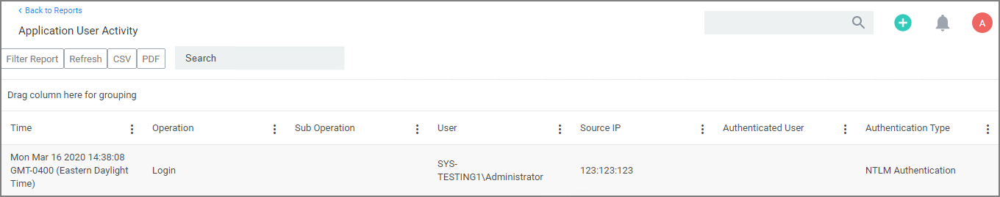

[title]: # (App User Activity)
[tags]: # (reports, auditing)
[priority]: # (7011)
# Application User Activity

Auditing for user activities like logins and logouts can be viewed via the Application User Activity report. The report is a chronological data collection of user login/logout events and relating data.

To access the report navigate to __Reports__ and locate the __Security__ reports, select __Application User Activity__.

User activity auditing is by default enabled. The following auditing data is stored and provided via report:

* User resource ID.
* Username associated with the resource ID.
* IP address from the system used to login.
* Date and time of the login/logout.
* Activity information, like successful login, unsuccessful login, logout, etc.

The report can be distributed via standard Email Report task.
