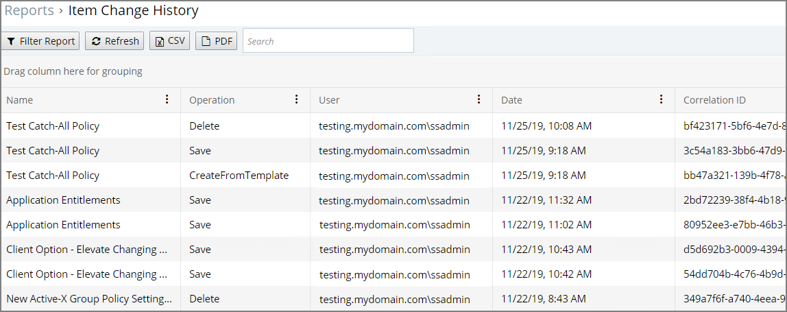

[title]: # (Change History)
[tags]: # ( )
[priority]: # (7001)
# Change History Report

Administrators need to be able to look at changes done by other users in Privilege Manager. The need to be able to audit any issue causing changes to configuration settings, policies, filters, and actions. The new __Change History Report__ allows Privilege Manager Administrators to track changes and their impact on endpoints.

As part of the audit the following information is recorded:

* User account initiating the change.
* Date/Time of the change.
* Description of the change made.

The following changes are reported:

* Configuration settings to Advanced, Discovery, and Reputation items (new tab on Configuration page)
* Changes to items, like
  * User and Group changes inside Roles
  * Credentials added or existing credentials updated
  * Foreign system added or existing updated
  * Any setting in the Advanced tab
<!--  * Authentication provider changed -->
  * Changes to conditions of user editable resources.
* Policy, actions, filters, resource target changes, and additions (new tab on policy, actions, filters, resource target pages)
* Editing of task schedules (parameters and schedule of a task) - any change made to the schedule and parameters (New tab on task schedule page for each individual task)
* Imports and Saves of XML - differentiate between import and save

The reporting of any of these changes cannot be turned off and the results can be filtered by categories like Policy, Filter, Action, and Configuration.

Each save creates or adds to the revision history of items. The __Item Change History Report__ cannot be used to revert to a previous state.

