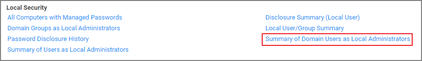

[title]: # (Domain Users in Admin Group)
[tags]: # (local security reports)
[priority]: # (7010)
# Domain Users in Administrator Group

You can get instant reports by clicking the Reports tab. To see which domain users are members of the administrators group, view the domain users as local administrators report.

Click the Summary of Domain Users as Local Administrators report to view details:

Selecting any of the accounts listed, open the Drilldown report for that specific item:

