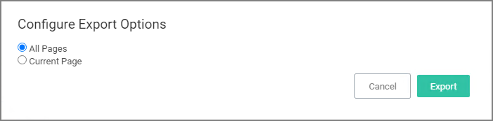

[title]: # (Reports)
[tags]: # (overview)
[priority]: # (7000)
# Reports

Privilege Manager includes an array of reports. To access reports navigate to the top menu, click the Reports tab for a list of relevant out-of-the-box reports that span a spectrum of system activity and diagnostic information in Privilege Manager.

Click on the name of any of these reports to access details about your system.

The __Select Report Options__ button lets users customize which of the default report options are shown on the landing page.

Users can set the amount of data entries to display per page. The default is 10 rows per report page displayed.

## Export Options

Privilege Manager reports can be exported via __CSV__ and __PDF__ export option buttons.

Once the __CSV__ or __PDF__ button is clicked, users can choose to

* export the current page or
* export all pages.

>**Note**: Selecting all pages might take some time to complete, depending on the overall size of the data records to export.

<!-- removing mini-toc until after UI redesign and doc rework
The following topics are available:

* [Reports and SQL Queries in Privilege Manager](reports-queries.md)
* [Change History Report](change-history.md)
* [Performance Reporting](performance-reporting.md)
* [Logon Session Summary Report](logon.md)
* [Primary User](primary-user.md)
* [Domain Users in Admin Group](domain-users-admin.md)
-->
