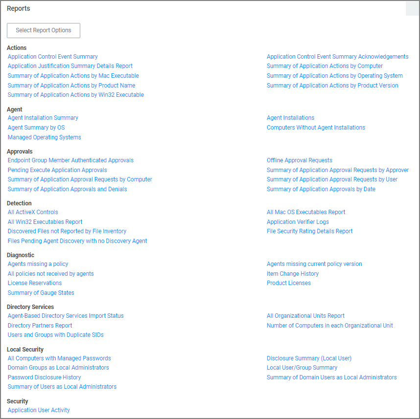

[title]: # (Reports)
[tags]: # (overview)
[priority]: # (7000)
# Reports

Privilege Manager includes an array of reports. To access reports navigate to the top menu, click the Reports tab for a list of relevant out-of-the-box reports that span a spectrum of system activity and diagnostic information in Privilege Manager. 

Click on the name of any of these reports to access details about your system.

The Select Report Options button lets users customize which of the default report options are shown on the landing page.

The following topics are available:

* [Reports and SQL Queries in Privilege Manager](reports-queries.md)
* [Change History Report](change-history.md)
* [Performance Reporting](performance-reporting.md)
