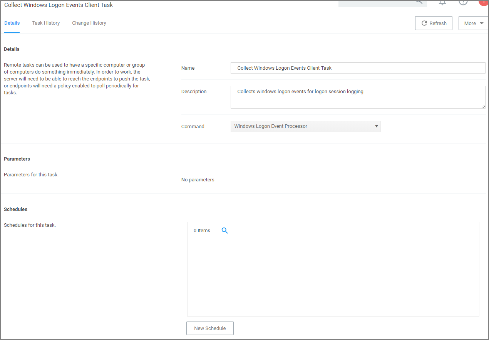

[title]: # (Logon Session Summary Report)
[tags]: # (logon)
[priority]: # (7010)
# Logon Session Summary Report

The Summary report for recent Logon Sessions.

1. Navigate to the Privilege Manager Dashboard.
1. In the Search field enter __Logon session__.

   
1. Click on __Logon Session Summary__.
1. The report contains the information for the Computer Name, User Name, total minutes and sessions.
<!-- TODO: Two new screen captures once I find a system that creates output for this report -->

   
   >**Note:** You can also run the __Collect Windows Logon Events Client Task__ to get updated windows logon events for logon session logging.

   
