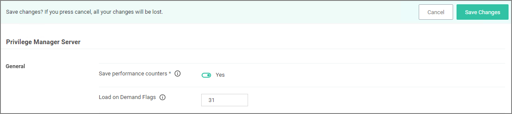
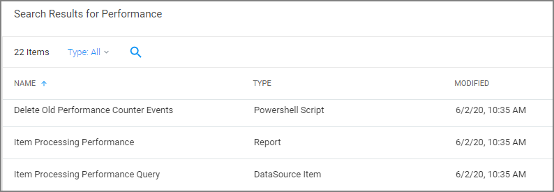

[title]: # (Performance Reporting)
[tags]: # (reports)
[priority]: # (7010)
# Performance Reporting

Performance Reporting is available for Privilege Manager 10.5 and up.
Nightly tasks can collect performance information in the following reports:

* Item Processing Performance
* Processing Performance

## Setting up Performance Reporting

1. Navigate to __Admin__ | __Configuration__.
1. Select the __Advanced__ tab.
1. Click __Edit__ on the bottom of the page.
1. Check the box next to __Save performance counters__ under the General tab.
1. Click __Save__.

   
   >**Note**: Once the __Save performance counters__ box is checked, find the performance reports by searching for their names ("Item Processing Performance" and "Processing Performance") in the search bar.

   
