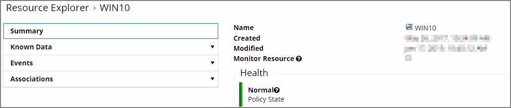
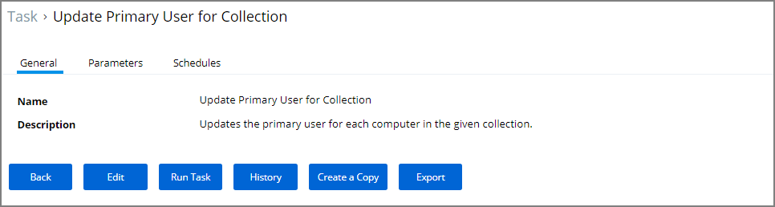

[title]: # (Primary User)
[tags]: # (primary)
[priority]: # (7010)
# Primary User

The primary user is calculated by the data reported from the Logon Session inventory policy.  The primary user is considered to be the user with the most minutes on the machine.

## How to Find the Primary User for a Specific Machine

1. Navigate to your __Local User/Group Summary__.
1. Select the system for which you want to know the primary user.
1. Click on __Associations__.

   
1. This will display the __Computer Primary User__.

## Default Update Primary User for Collection

The default update primary user for collection task calculates the primary user on a schedule from inventory data.

1. Navigate to __Admin | Tasks__.
1. Expand __Server Tasks__.
1. Click on __Local Security__.
1. From here you can run the __Update Primary User__ or the __Update Primary User for Collection__ Task.

   

   >**Note:** The Update Primary User Task only updates the primary user for a given computer resource.
