[title]: # (Reports and Queries)
[tags]: # (overview)
[priority]: # (7001)
# Reports and Queries

Each report in Privilege Manager runs a SQL query to return the results. The application does a great job opening the existing queries it uses and generating resolved queries to be used for testing.

This makes it very easy to run Privilege Manager reports – including custom reports – outside of the application in SQL Server Reporting Services, SQL Server Management Services, or your favorite tool.

This topic gives an overview of finding and using the reports and SQL queries built-in to Privilege Manager.

## View the Existing Reports in Privilege Manager

Most users are probably familiar with the main Reports section of Privilege Manager, which is accessible from the menu at the top of any page. This page includes many common reports. There is a __Select Report Options__ button on this page that allows a user to remove reports from this list.

There are many more reports in the product.

To view all the reports in Privilege Manager, navigate to the __ADMIN | Folders | Reports__ tab to see all the reports in a folder tree structure.

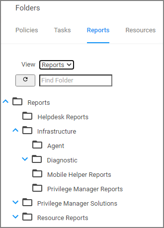

Expand the folder tree to explore the canned reports.

For example, to access the __Application Justification Summary Details Report__, navigate to __Reports | Resource Reports | Resource List Reports | Application Control | Data Class Reports__ and select the __Application Justification Summary Details Report__.

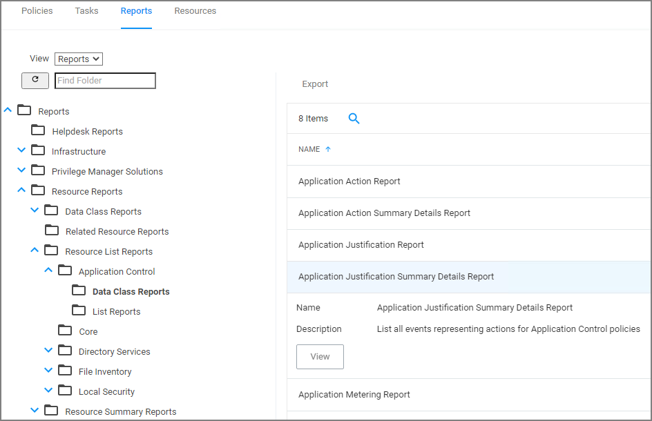

## Determine the SQL Query Object Used by a Report

Every report in Privilege Manager is a single XML object and references a separate XML object that contains the SQL query. By viewing the report object's XML, the SQL query object can be determined.

To view the report as an XML object, change the URL from:

`[Your_TMS_URL]/PrivilegeManager/#/item/__view__/9ba09fa5-ea7e-4352-8400-8eb58b8e41f9`

to:

`[Your_TMS_URL]/PrivilegeManager/#/item/__xml__/9ba09fa5-ea7e-4352-8400-8eb58b8e41f9`

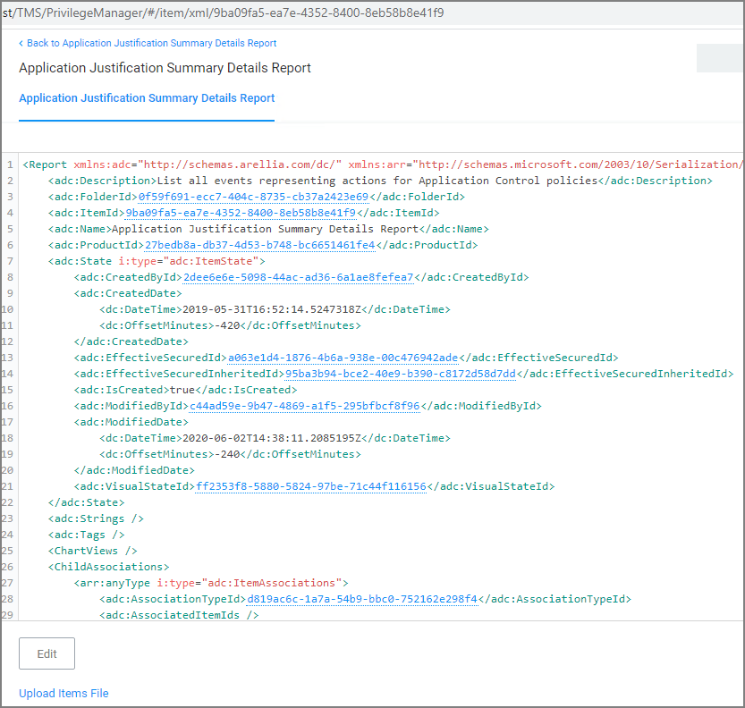

Viewing an item as XML helps in determining what folder it is located in (which will be explained in more detail below). Viewing a report as XML also reveals the XML object for the SQL query.

Use your mouse to hover over the GUIDs in the XML to reveal the name of each GUID's object. Within the section for ChildAssociations, there will an association for the Report's DataSource. Hovering over the GUID for the AssociatedItemId before the Report's Datasource will reveal the report's query.

In the screenshot below, hovering over the GUID is 9a3d82a3-c7be-47cc-aa1c-48acc7964620 identified that item as the __Application Justification Summary Details Report Query__.

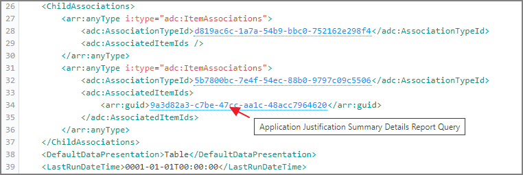

Clicking on this GUID will open the XML for the query object in another tab on this same screen:

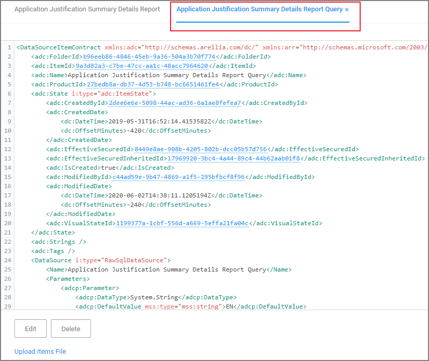

The XML object for the query includes the direct SQL query that the application runs. However, viewing the query in Privilege Manager will give better query results to work with.

## View the SQL Query in Privilege Manager

The SQL queries can be viewed in Privilege Manager under __ADMIN | Folders__, but it will be helpful to know the folder in which a specific query is located. In the XML object for query, hover over and click on the GUID for the FolderId.

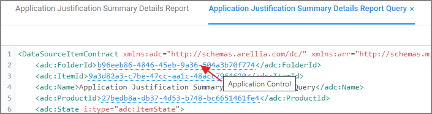

This will open the XML for the folder in which the query is contained. 

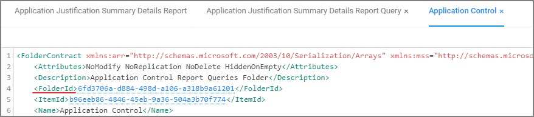

Click on the FolderId to open the XML for its parent folder, and continue until reaching the root folder – which will not have a FolderId attribute. For the SQL queries, the root folder is Queries.

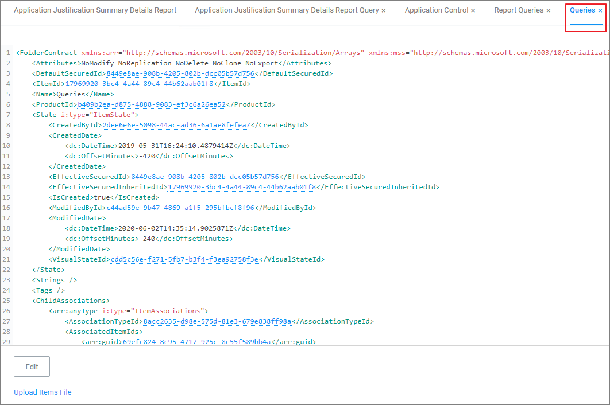

This XML view now shows the full folder location of this specific query: __Queries | Report Queries | Application Control__.

### Access and Edit the Query from the Folder View

Navigate to __ADMIN | Folders__ and select the Reports tab. From the View pull-down, select the Queries View. Then navigate the folder structure determined above: __Queries | Report Queries | Application Control__. Select the __Application Justification Report Query__ from the center pane.

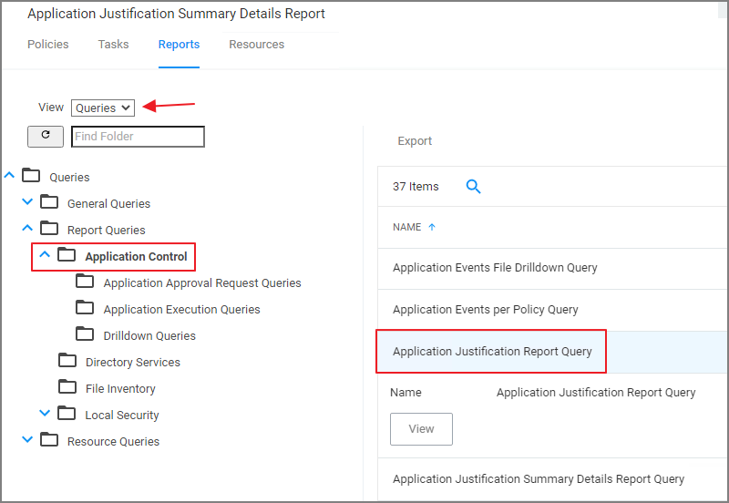

View this query object. The Query tab will show the SQL query that the application runs. This is the same query that appears in the XML of the object.

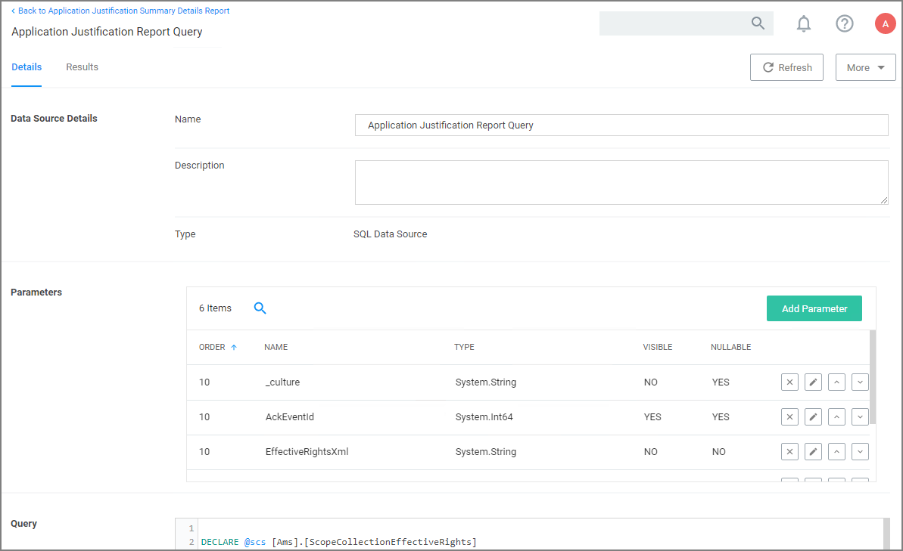

Scroll to the bottom section of the page to edit the query xml.

### Resolved Query

The Resolved Query tab will give queries that can be used directly on the database to return the similar results that the application receives when it runs the query in the object. This makes it easy to run these queries – or customization of them – in SQL Server Reporting Services.

On the Resolved Query tab, checking the box to __Show Output as Executable Anonymous Block__ will assign values to the Parameters the query uses. For the __Value Set__ pull-down, select __Test__ to assign the Parameters with appropriate values to run this query directly on your database.

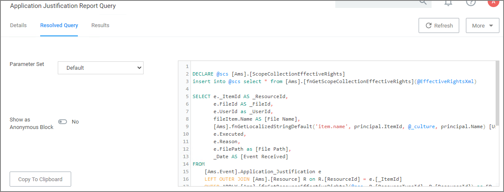

Click __Copy To Clipboard__ and then paste the resolved query in SSRS, SSMS, or your favorite tool.

### Results

The Results tab provides options to change information of the query.

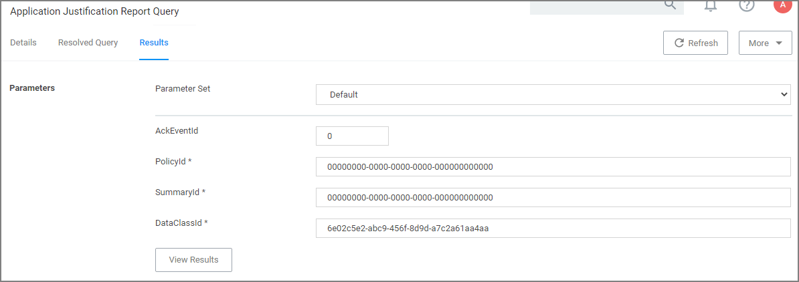

The parameters can be changed and specific item Ids can be entered.

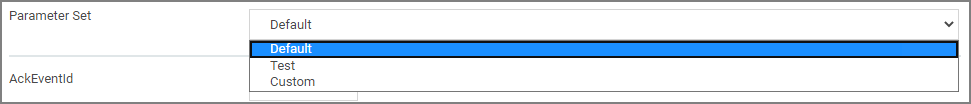
