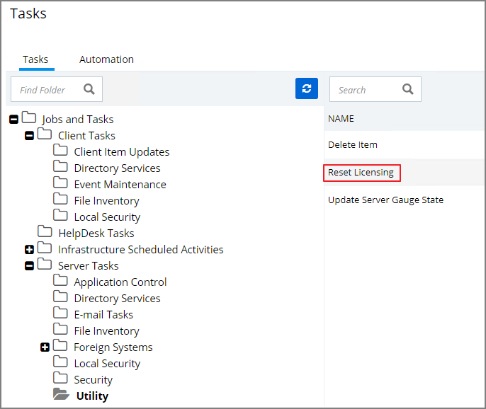
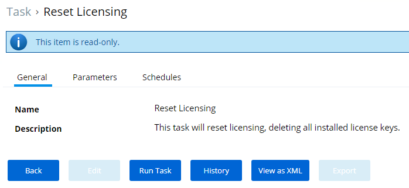
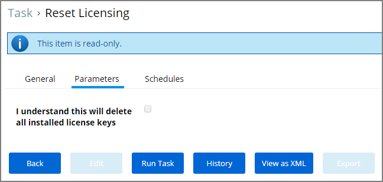
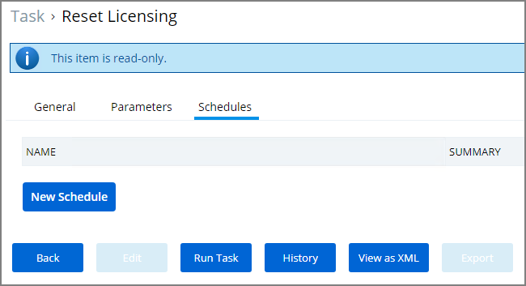
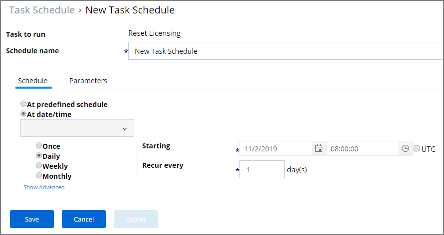

[title]: # (Reset Licensing)
[tags]: # (server utility tasks)
[priority]: # (6002)
# Reset Licensing

With Privilege Manager 10.7 and up license registrations can be reset. The Reset Licensing task allows upgrading users to remove outdated licenses.

After acknowledging the license reset, all licenses are removed from the Privilege Manager instance. When no licenses can be found, the no product licenses warning banner displays on the top of the console.

## Using the Reset Licensing Task

1. Navigate to the __Admin | More...__ and select __Tasks__.
1. From the Tasks folder tree, select __Server Tasks | Utility__.
1. From the options on the right, select __Reset Licensing__.

   

   Reset Licensing is a read-only task.

   

   However to run it, the user needs to acknowledge the removal of all installed license keys via the Parameters tab.
1. Go to the Parameters tab and select the checkbox __I understand this will delete all installed license keys__.

   

   The task does not run without that acknowledgement and an error is generated.
1. Click __Run Task__ or set a schedule when to run this task during a maintenance window.

   
   1. On the Schedule tab, click __New Schedule__.
   1. On the New Task Schedule specify when to run the Reset Licensing.

      
   1. Click __Save__.
