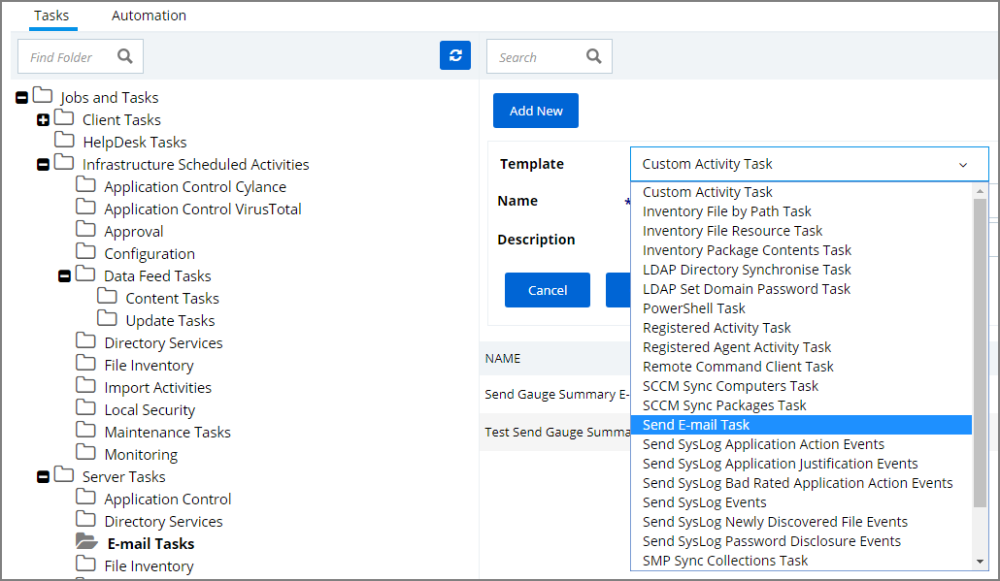
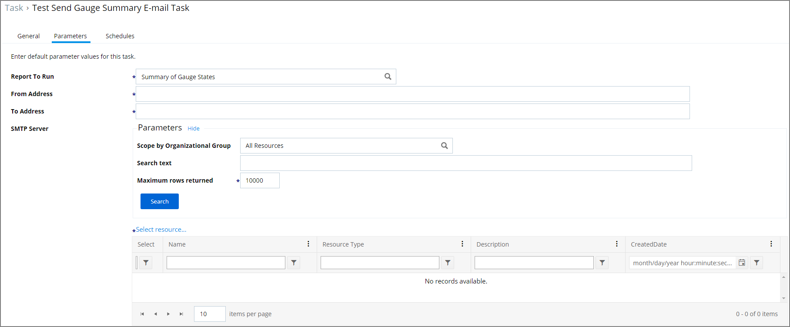
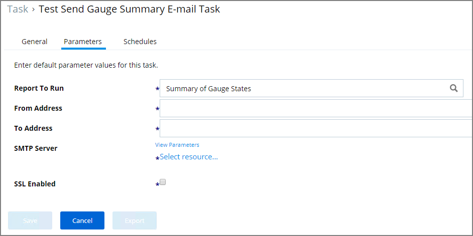
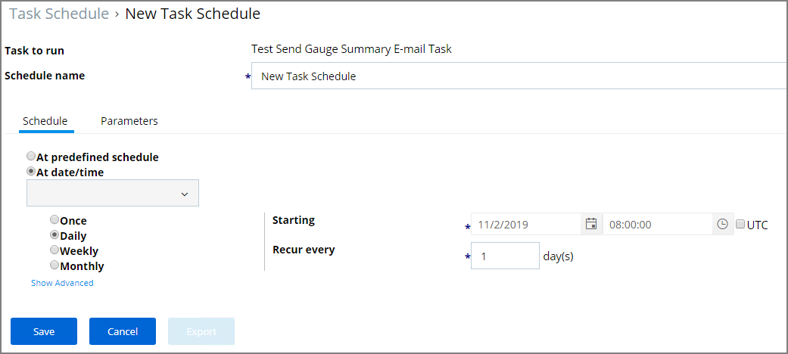

[title]: # (E-mail Reports)
[tags]: # (scheduled tasks)
[priority]: # (2)
# E-mail Reports Task

Any report created in Privilege Manager can be sent to a group of recipients based on a scheduled task.

To set this up, create a new Server task to send emails.

1. Navigate to __ADMIN | Tasks__.
1. In the folder tree open __Server Tasks | E-mail Tasks__.
1. Click __Add New__.

   
1. From the drop-down select __Send E-mail Task__.
1. Enter the task name and description.
1. For the __SMTP Server__, you can search via Parameters by specifying

   * Scope by Organizational Group
   * Search text
   * Maximum rows returned (default 10000).

    >**Note**: This requires a SMTP Server Foreign System set-up.

1. Click __Search__.
1. Click __Select resource...__ and select a server from the search results.

   
1. Click __Create__.
1. Click __Edit__.
1. Go to the Paramters tab.

   >**Note:** For cloud environments the SMTP server settings are pulled for an existing configuration and can't be edited via the parameters tab.

   
1. In the __Report to Run__ field enter/search for the report you wish to send.
1. In the __From Address__ field enter the sender information you wish to be provided.
1. In the __To Address__ field specify the recipient(s) (this can be a comma-separated list of addresses).
1. Select the checkbox for __SSL Enabled__.
1. Click __Save__.
1. Go to the __Schedules__ tab.
1. Click __New Schedule__.

   

   Set up the schedule specifics for this task.
1. Click __Save__.
