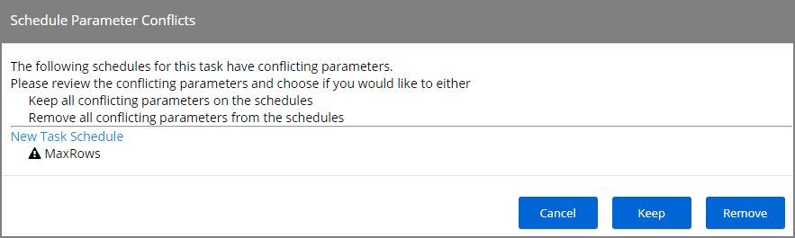

[title]: # (Scheduled Tasks)
[tags]: # (regular)
[priority]: # (5)
# Scheduled Tasks

In addition to maintenance tasks, there are other tasks that should be scheduled to run regularly by Privilege Manager administrators. It's recommended to run these tasks to determine how long they take to complete in each environment, then schedule appropriately to cover task completion and needs.

## AD Import and Synchronization Tasks

Import Active Directory users and groups on demand and based on a set schedule.

>**Note**: Depending on AD structure and size, the tasks should be planned to avoid bulk imports and synchronization of too large of a number of accounts.

## Task Parameter Conflicts

When task parameters are set at the task level, they can't be changed when a schedule is created for that task. However, in some circumstances, if you have already defined parameters at the task schedule level and then go back to the task to set the values, you may end up with task schedule parameter conflicts. When there are conflicts with the version currently on the server, the Privilege Manager console shows a modal to resolve the existing conflicts before any schedule modifications can be saved.

The user can review the task that introduced the conflict by clicking the linked item, which is opened in a new browser tab.

The options to resolve are

* Keep all conflicting parameters on the schedule - click the __Keep__ button.
* Remove all conflicting parameter from the schedule - click the __Remove__ button.

Or cancel if you wish to clean up the conflicts by manually editing task parameters on the conflicting items.
However, something indicated as a conflict isn't necessarily a problem. The functionality is implemented so that users have the ability to stop changes on the schedule level by setting something other than default on the task level. If a parameter on the task is a default value, then that parameter will not be in conflict, if it does not match on the schedule.

Whenever there is a deviation from the default value on the task level, even with the parameter on the schedule matching, users are asked to resolve the conflict by keeping the current values.
