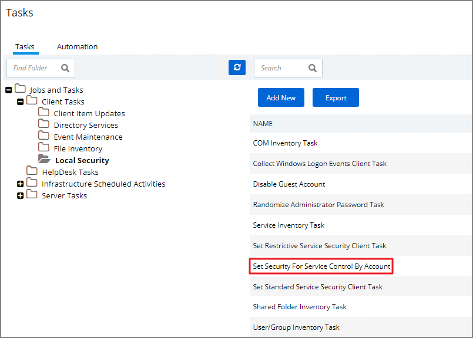
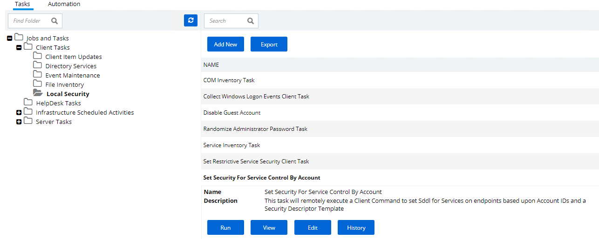
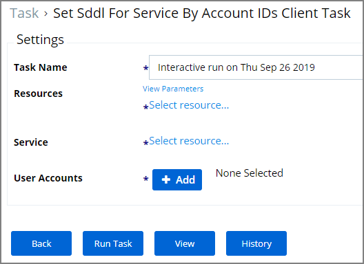
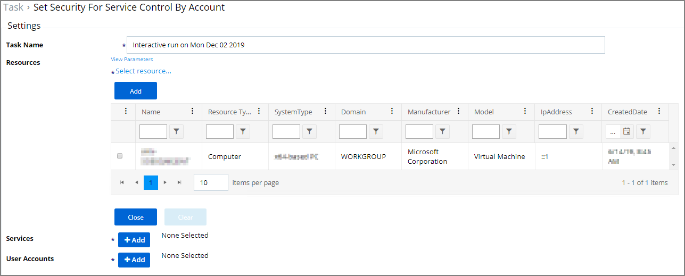
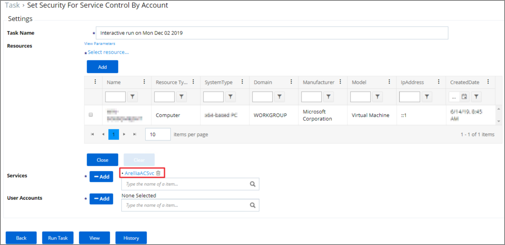
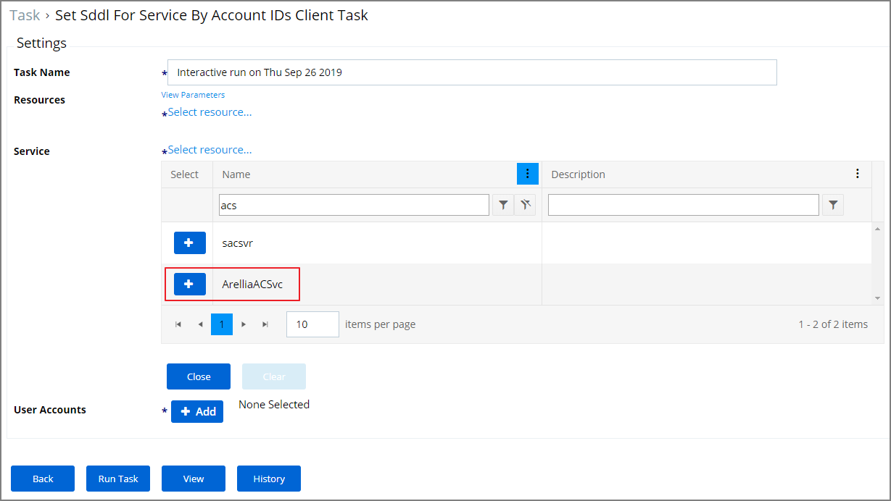

[title]: # (SDDL by Client ID)
[tags]: # (intro)
[priority]: # (6020)
# SDDL by Client ID Task

Setting up the __Set Sddl For Service By Account IDs Client Task__ allows Privilege Manager Administrators to restrict agent control rights on the endpoints. The tasks allows to pick one or more user/group accounts to be associated with the SDDL used to secure services on the endpoints.

The procedure below describes the required steps to run this task once on the targeted endpoints. This task is not suited for scheduling. Once the task runs on the targeted endpoints, it won't need to be applied again to the same set of resources.

Multi-service resource targeting is not available in this version and the task needs to be run for each agent service, once to target the Thycotic Agent service (ArelliaAgent) and once to target the Thycotic Application Control service (ArelliaACSvc).
<!-- TODO: delete this sentence once multi-service selection is in the product and remove commenting syntax on step 6.b below -->

## Creating the Task

To secure agent access control on the endpoints set up the __Set Sddl for Service by Account IDs Client Task__ based on the following steps:

1. Navigate to __Admin | More__ and select the __Tasks__ link.
1. Open the Local Security folder.

   
1. Select __Set Sddl For Service By Account IDs Client Task__ from the list of available Tasks.
1. Click __Run__.

   
1. Under Resources click the __Select resource...__ link to select the computers or groups to be targeted by the task.

   
   1. Depending on your Local Security set-up this table can contain many records. We recommend using the filter function on the name column to filter and then set the checkboxes for specific items. Multiple resources can be specified.

      

1. Under Services click the __Select resource...__ link to select the Services to be targeted by the task.
   1. In the Name filter enter agent and select the ArelliaAgent from the list of filtered items, click the __+__ button.

      
<!--   1. In the Name filter enter acs and select the ArelliaACSvc from the list of filtered items, click the __+__ button.

       -->
1. Under User Accounts click the __+__ button and use the search field to find the specific user account that has permissions to make changes to the Agent services. 
1. Click __Run Task__.

Once the task runs the Start and Stop options for the two agent services is disabled for all users that don't have the Agent Administrator role.
