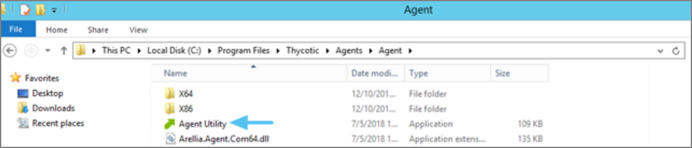
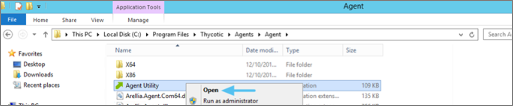
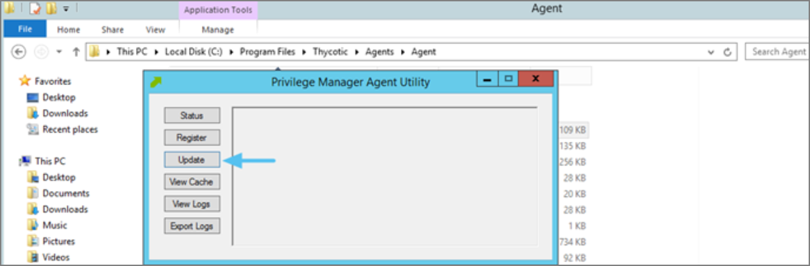

[title]: # (Client Item List Downloads)
[tags]: # (agents, keyset)
[priority]: # (2)
# Client Item List Downloads
When you run the UpdateClientItems.ps1 PowerShell script to update policies on a
machine you see errors below:

*Error: [FAILED] Downloading Windows Group Policies client item list - Keyset does not exist*

>**Note:** This will only affect systems prior to Privilege Manager 10.7.

## Resolve

1.  Navigate to the Machine(s) where you want to update the policy.

1.  Open the Agent Utility by going to `C:\Program
    Files\Thycotic\Agents\Agent`

    

    

1.  Click **Update**.

    
