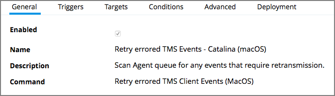
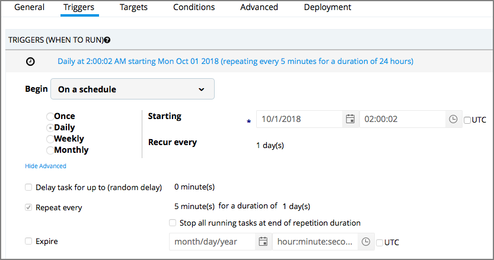
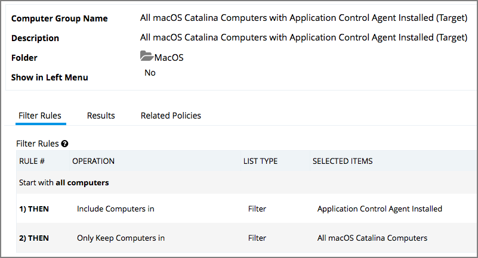
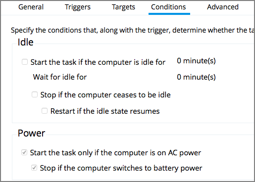
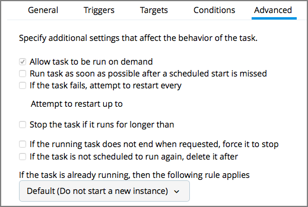

[title]: # (macOS - FileSystemWatcher)
[tags]: # (catalina)
[priority]: # (2)
# Catalina FileSystemWatcher Issue

To prevent application control problems on macOS Catalina based endpoints due the known macOS FileSystemWatcher issue, Thycotic provides the Remote Scheduled Client Command policy __Retry errored TMS Events - Catalina (macOS)__.

The defaults for this new Remote Scheduled Client Command are as follows:

* On the General tab:

  

* On the Triggers tab:

  Customize the schedule if necessary to best suits your particular implementation.

  

* On the Targets tab:

  The default resource targets required is specified by default as __All macOS Catalina Computers with Application Control Agent Installed (Target)__. The results of the computer group include any macOS Catalina computers are that have the agent installed and are properly configured for Application Control.

  

* On the Conditions tab:

  

* On the Advanced Tab:

  

Once the policy is enabled on an endpoint, the agent performs the __Retry errored TMS Client Events (MacOS)__ command and send any files that might be in the /Library/Application Support/Thycotic/Agent/Transfer due to the Catalina FileSystemWatcher bug.
