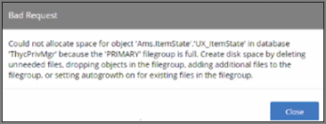
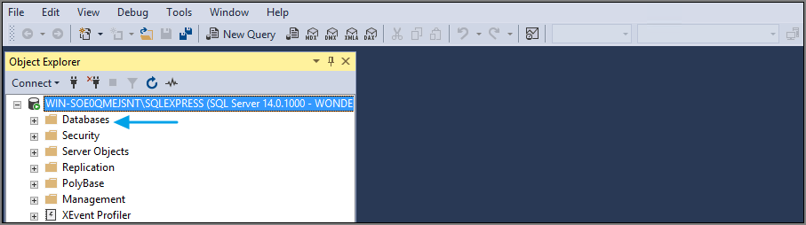
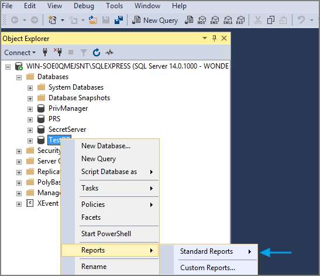
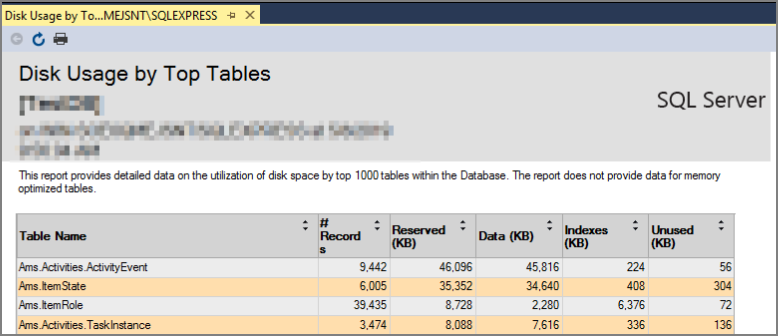

[title]: # (Error: Space Allocation)
[tags]: # (database object)
[priority]: # (10100)
# Error: Space Allocation

This topic describes the following error while working with Privilege Manager:

__Could not allocate space for object 'Ams.ItemState'.'UX_ItemState' in database 'ThycPrivMgr' because the 'PRIMARY' filegroup is full.__

The error indicates that either the Privilege Manager database is full and out of space or the database server running is out of space.

## Resolving the Error

1. Navigate to SQL Server Management Studio.
1. Click Connect.
1. Expand Databases.

   
1. Right-click on the Privilege Manager Database, select __Reports__.
1. Select __Standard Reports__.

   
1. Select Disk Usage by Top Tables report.

   
1. The report shows the top tables by data usage.
1. If the top table does contain a lot of data, locate the table which contains the highest number of files and open a support case. Provide the information collected with a screenshot of the report to determine the best way to reduce the size of the table.

   If the top tables do not contain a lot of data, the issue could possibly be:

   * The database server is running out of disk space.
     You can check to see what drive the database is stored on to see how much space is left. This will be specific to your environment regarding disk space.
   * Check if there are other databases on the same server and investigate if a different database is taking up space.
