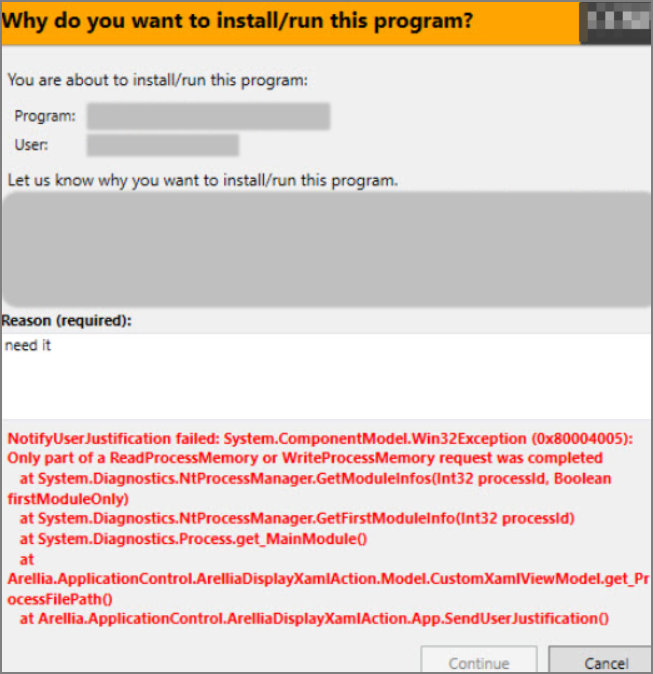

[title]: # (Notify User Justification failed)
[tags]: # (database object)
[priority]: # (3)
# Notify User Justification failed

You receive the following error when users attempt to run a program with a policy that uses the action for Notify User justification.

## Resolve

1. Either disable the Anti-Virus Real time scan.
1. Or, set Anti-Virus Real-time scanning exclusions.
