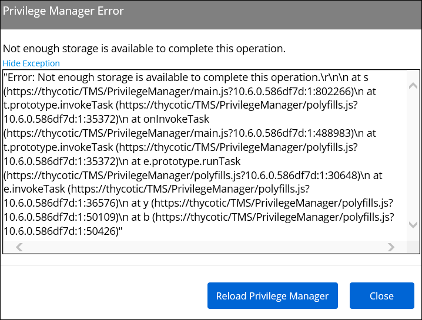

[title]: # (UI Storage Error)
[tags]: # (browser cache)
[priority]: # (3)
# UI Storage Error

You might have to clear your browser cache if you get the following error in the Privilege Manager console:

__Not Enough Storage is available to complete this operation__

## Resolution

1. Open your browser window and clear the cache.
1. Close and re-open the browser
1. Launch Privilege Manager and re-try the action.

   >**Note**:
   >If the error continues, open a different browser and try to replicate the error. Save any screenshots and open a support case.
1. If this occurs while on the server, please ensure that there is enough disk space to complete the action.
