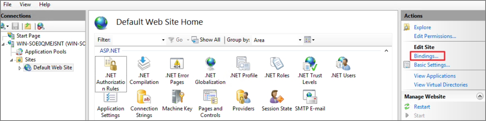

# Installation hangs with error: Worker Role Monitor received exception during ping

During the installation of Privilege Manager the install hangs and is unable to procced to the next step of the installation.

After checking the Thycotic Monitor, you see the below error in the log viewer:

*Worker Role Monitor received exception during ping: The HTTP request is
unauthorized with client authentication scheme 'Negotiate'. The authentication
header received from the server was 'Negotiate,NTLM'*

**Note:** This error is due to a host name in the binding within IIS.

Resolve
-------

1.  Open **Internet Information Services (IIS) Manager**.

    

2.  Expand down to **Sites**.

    

3.  Click **Default Web Site** or the **top node site**.

    

4.  Click **Bindings**.

    

5.  Select the **HTTPS binding** \| click **Edit.**

    

6.  Confirm that there is no Hostname included for the HTTPS binding for the TMS
    site. If so, please delete it.

    

7.  **Recycle** all the TMS application pools in IIS.

    

8.  Try the install again by going to **https://localhost/TMS/Setup**.
