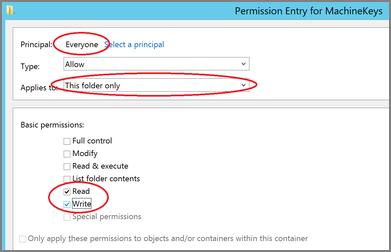

[title]: # (10.5 Folder Permissions)
[tags]: # (troubleshooting)
[priority]: # (2)
# 10.5 Folder Permissions - MachineKeys 

During installation of Privilege Manager 10.5 (or an upgrade from prior versions) Privilege Manager attempts to create a new self-signed certificate for internal use. If permissions on the folder `%ProgramData%\Microsoft\Crypto\RSA\MachineKeys` are incorrect, the install fails with a cryptographic exception and the text __Access Denied__.

Follow the steps below to add Everyone (Read, Write, This Folder Only) permissions to `%ProgramData%\Microsoft\Crypto\RSA\MachineKeys`.

1. Browse to `%ProgramData%\Microsoft\Crypto\RSA\MachineKeys`. 
1. Right-click on the folder and select __Properties__. 
1. Select the __Security__ tab and click the __Advanced__ button.
1. On the __Permissions__ tTab, click the __Change permissions__ button. (If you are already running as an administrator, you may not need this step.)
1. On the __Permissions__ Tab, click __Add__.
1. On the next dialog, click the __Select a principal__ link.
1. In the __Enter the object name to select__ field, type __Everyone__ and click __OK__.
1. You will see the dialog shown below, select __This folder only__ and __Read and Write__.

   
1. Click __OK__ to add the entry.
1. Click __Apply__ to apply the changes.
1. Navigate back to the Privilege Manager Setup page and select the repair option for the Privilege Manager Server Core Solution.
