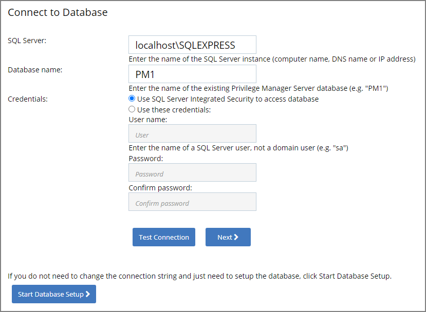

[title]: # (DB Connection)
[tags]: # (help,setup,update)
[priority]: # (3)
# Databased Connection Issued during Setup/Update

When accessing the Privilege Manager console or during an instance update, if one of the databases is unreachable the user is directed to the "Connect to Database" screen.

Reasons for this state:

* The SQL Server service is not reachable. Check the service and restart if necessary.
* The SQL Certificate has expired. Delete the old certificate and have the server recreate the certificate.
* SQL Server authentication method changed. Depending on the selection during initial setup, the credentials used come from either
  * SQL Integrated Security settings and no further details need to be entered when the first radio button is selected. This is usually the account information for the account running the application pools for Privilege Manager in IIS.
  * Overwrite Account credentials when the second radio button is selected.

If a database connection ever needs to be updated, the __Connect to Database__ page can be accessed from the browser by navigating to `.../TMS/Setup/Database/ConnectDatabase`. To access the page the user would need to be a Privilege Manager Administrator with local admin rights.
