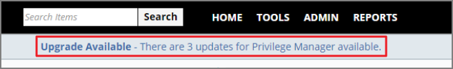
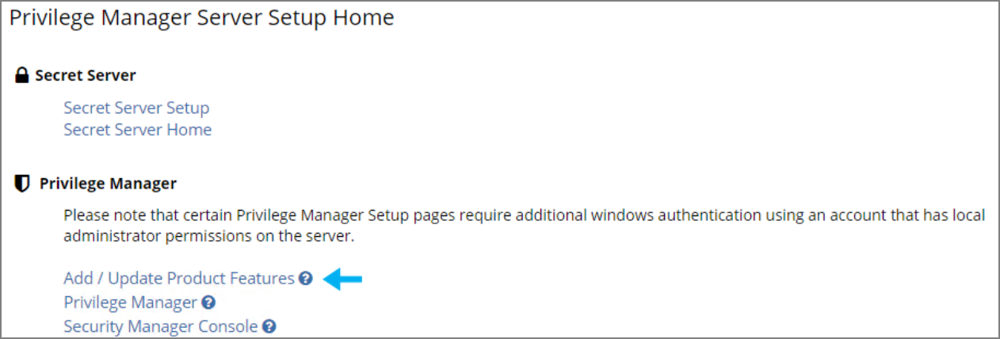
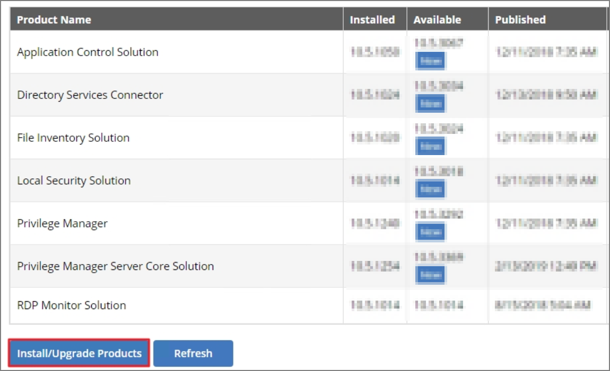

# Error: Invalid product identifier: { id = thycoticTmsInternalMaintenance }

When attempting to upgrade Privilege Manager, you receive the following error:

*Error: Invalid product identifier: { id = thycoticTmsInternalMaintenance }*

## Resolve:

1.  Navigate to **https://[YourInstanceName]/TMS/Setup**.

2.  Click the **Upgrade Banner** at the top of the Privilege Manager home page.

    

3.  Click **Add / Update Product Features**.

    

4.  Click **Install/Upgrade Products**.

    

5.  Select **ALL** of the required solutions.

6.  Click **Install** and the upgrade process will begin.
