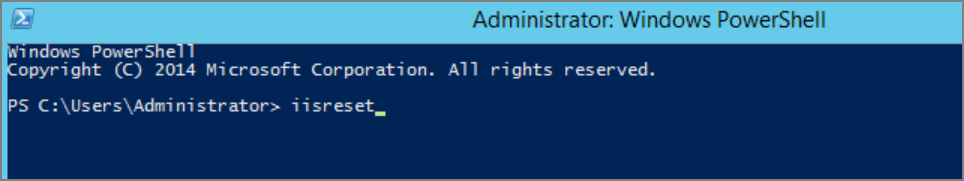

# Retrieving the COM class factory error

While attempting to upgrade Privilege Manager, you receive the error message
below when accessing
[https://[YourInstanceName]/TMS/Setup](https://[YourInstanceName]/TMS/Setup).
The window is unable to load with the following error message:

*“Server Error in '/Tms/Setup' Application.*

*Retrieving the COM class factory for component with CLSID
{228FB8F7-FB53-4FD5-8C7B-FF59DE606C5B} failed due to the following error:
800703fa Illegal operation attempted on a registry key that has been marked for
deletion. (Exception from HRESULT: 0x800703FA).”*

Resolve
-------

1.  Close the browser window.

2.  Complete an IIS reset by searching for the Windows Powershell application.

3.  Right-click and select Run as Administrator.

4.  Enter in: **IISreset** \| hit **Enter**.

    

5.  Once the IIS reset has completed navigate back to
    [https://[YourInstanceName]/TMS/Setup](https://[YourInstanceName]/TMS/Setup).

6.  Click **Add / Update Product Features**.

    

7.  Click **Install/Upgrade Products**.

    

1.  Select **ALL** required solutions.

2.  Click **Install** and the upgrade process will begin.
