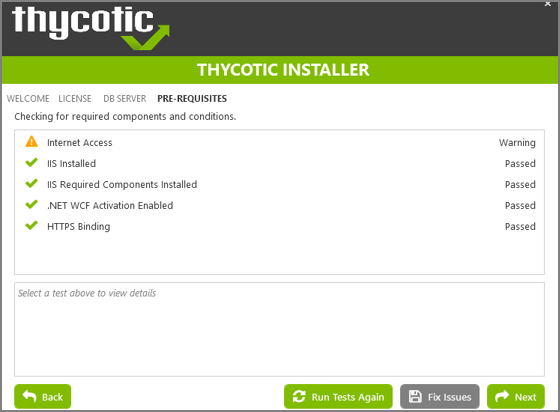
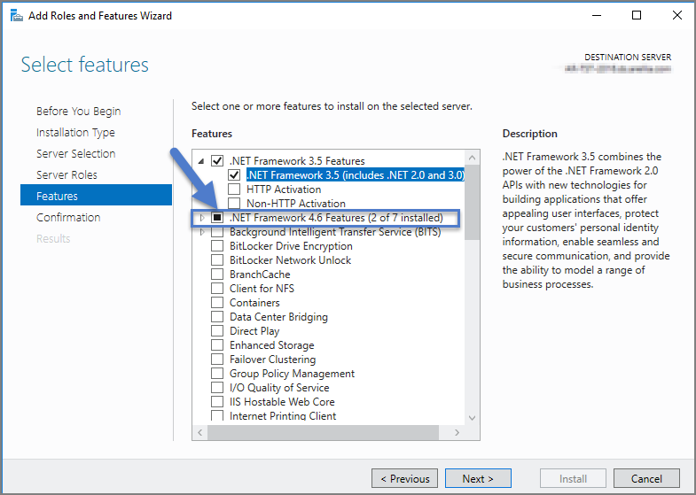
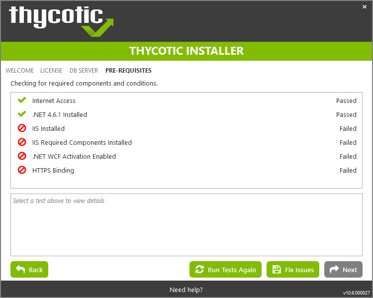
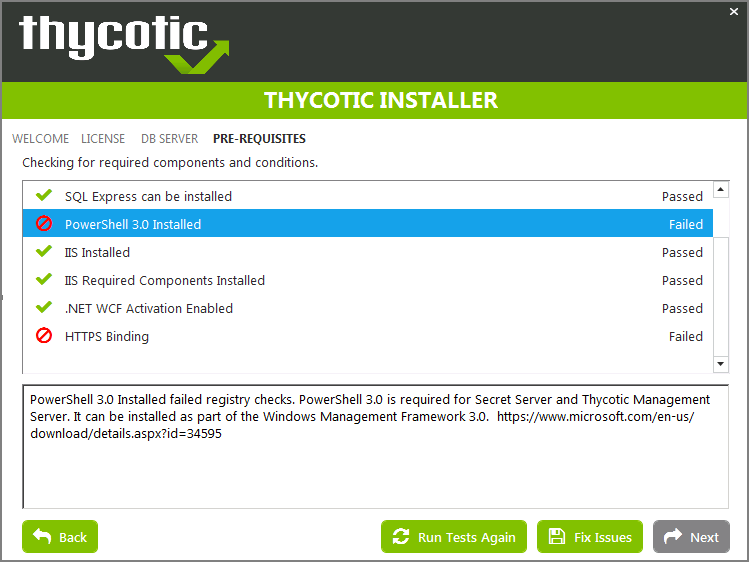
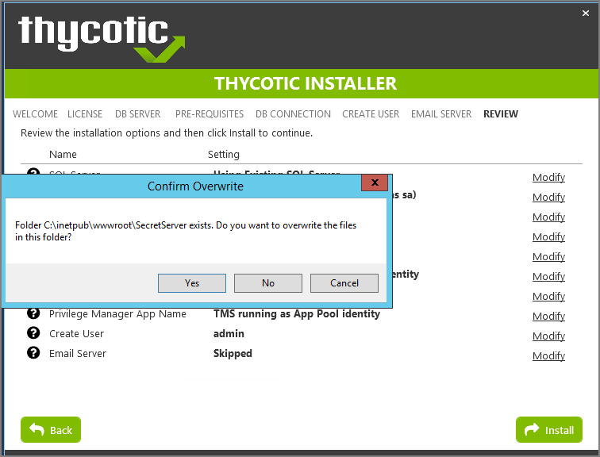
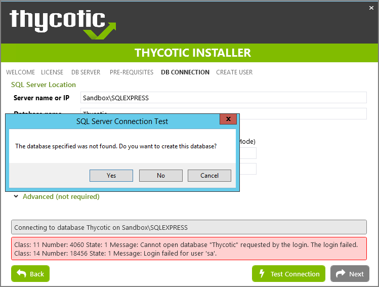
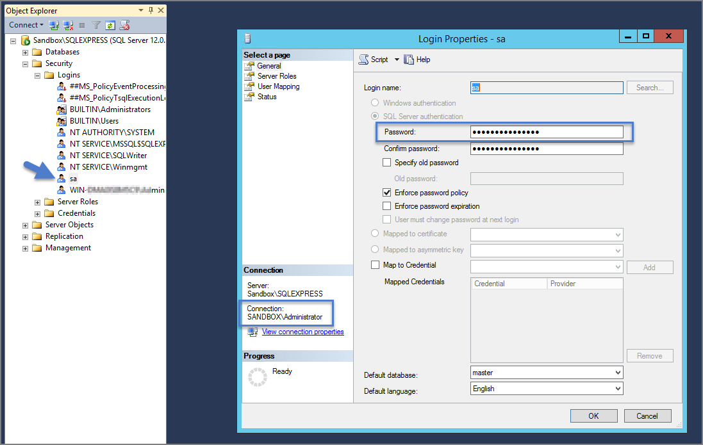
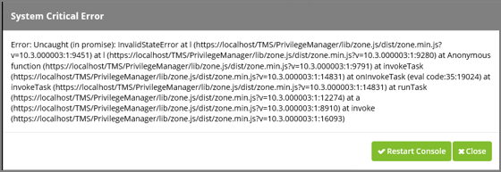
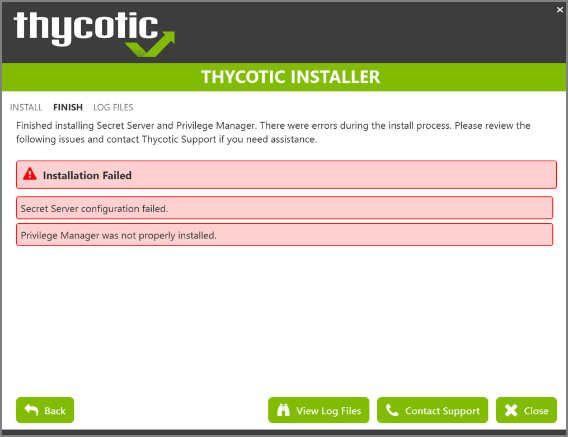

[title]: # (Installation Issues)
[tags]: # (help, overview)
[priority]: # (2)
# Installation Issues

This article provided troubleshooting tips to help anyone who hits a snag during an install for Privilege Manager.

## Internet Connection

If your server is not connected to the internet, you see the following:

To Resolve:

Click __Next__ to proceed through your installation offline.

## .NET Dependency

Don't have the required .NET version Dependency installed to accompany your SQL DB? This is what you will see:

To Resolve:
Click the Fix Issues button on the Thycotic Installer, then run the pre-requisites check again.

If the error persists, manually install the recommended .NET version.

1. Open your Server Manager, In the upper right side of the screen, click Manage, then Add Roles and Features from the dropdown list. This will open your Add Roles and Features Wizard. Verify that the correct Destination Server is listed in the upper right-hand side of the screen.
1. Click Next through the Wizard steps until you arrive on the Features page.
1. Check the box next to the latest .NET Framework, here it is the .NET Framework 4.6 Features, click Next.

   

Follow the rest of the Wizard’s steps until the install is completed.
Once .NET 4.6 or greater framework is installed on your server, then run the pre-requisites check again.

## IIS not Installated

Don't have IIS installed yet? This is what you will see:

To Resolve:

Click the Fix Issues button on the Thycotic Installer. Then run the pre-requisites checks again.

## HTTPS Binding Error

Did you encounter an HTTPS Binding Error? Does it not clear after using the Fix Issues button?

To Resolve:

__Close__ and re-open the Thycotic Installer and run the pre-requisites checks again.

If the Binding Error persists, verify the following:

For combined Privilege Manager and Secret Server installations, did you previously move the Secret Server app pool in IIS to its own website, rather than allowing it to reside under the Default website? [see this KB for details](https://thycotic.force.com/support/s/article/Convert-a-virtual-directory-to-a-website-in-IIS).

The installer checks the Default Web Site for an HTTPS binding, and whether there is a certificate assigned to it. This means that if you pre-created the Secret Server Web Application and assigned the HTTPS binding to that site, you may need to manually move your previously installed Secret Server IIS site to reside back under the Default Web Site in IIS when installing Privilege Manager.

## PowerShell Error

Are you receiving a Powershell error? You may be trying to install Privilege Manager on an outdated server! Here's what you will see:

To Resolve:

You may need to update the server you are installing on. Please see our System Requirements Guide for supported servers. You can also manually download Powershell 3.0 and install it from Microsoft's website here.

Once Powershell is properly installed on your server run the pre-requisites checks again.

## Secret Server and Privilege Manager Installed

Already have Secret Server installed on your server? Here is what you will see:

To Resolve:

We recommend installing new instances of Secret Server and Privilege Manager on a clean server.

If you do not already have an instance of Secret Server or Privilege Manager on this server to your knowledge, these files may exist due to an incomplete install. Check with anyone with access to this server who may have attempted this install previously. Only if you are confident that this is your first and only existing Secret Server or Privilege Manager instance click Yes to overwrite the existing files.

## Error in DB File Path

Trying to test your connection to an existing SQL database? Here's what you will see:

To Resolve:

This message means that your file path to your database is incorrect or your account does not have the correct permissions to access it.

If you have an existing database,

1. navigate to your SQL Server Management Studio and login.
1. Navigate to Security | Logins and right click on the account you are using for your Thycotic product, click Properties.

The information you need to enter in the Thycotic Installer for the connection path is listed in the bottom left corner under "Connection." You will also need to provide this account's password. Note that this account must have __db_creator__ permissions.

## Outdated Browser

Are you trying to open your newly installed Privilege Manager in an outdated version of Internet Explorer? Here's what you will see:

To Resolve:
Try opening Privilege Manager in a different browser, or update your Internet Explorer browser.

## Integrated Authentication Error

Are you using Integrated Authentication and your installation failed? Here's what you will see:

To Resolve:

For clients using Windows Integrated Authentication, the Thycotic installer does not validate your database connection, so entering the wrong database server, database name, or if the user account provided does not have access to the database, your install will fail without warning you in advance. To resolve, please verify your database connection settings and enter them correctly under the __DB Connection__ tab during the installation process.
