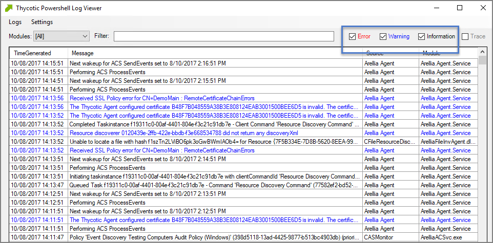

[title]: # (Agent Logs)
[tags]: # (where are)
[priority]: # (3)
# Where are My Agent Logs

If something is going wrong on specific endpoints, another place to look for answers is in your Agent's Event Log Viewer.

In your endpoint machine, navigate to your Thycotic Agent files. This is usually located in `C:\Program Files\Thycotic\Powershell\Arellia.Agent`. Right-click on AgentLogViewer and select Run with Powershell.  This will open your Agent Event Log Viewer, which shows updates in real time as the agent communicates with the Privilege Manager server.

For remote access, Agent logs are also viewable through the Windows Event Viewer.

Scroll all the way to the top of the page to see the most recent activity from your Thycotic Agent. Uncheck the Information box on the upper righthand corner to narrow search results for any Errors and Warning messages that may be occurring. You can also double-click any line item for more detailed information about each event.

