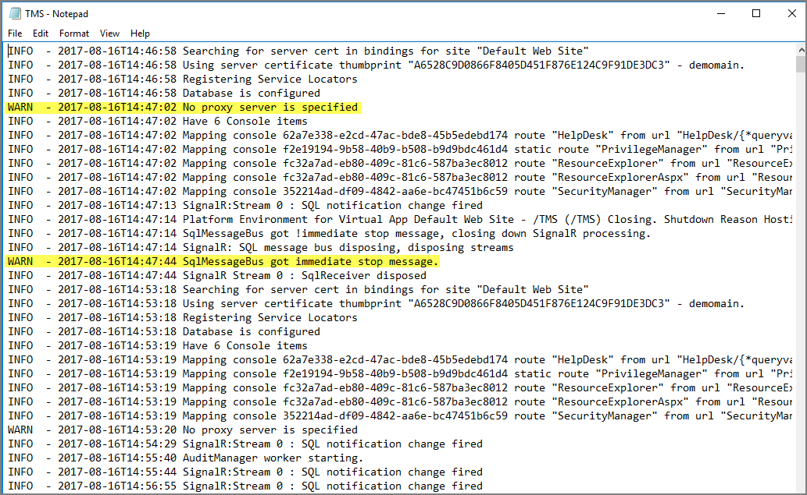

[title]: # (Server Logs)
[tags]: # (where are)
[priority]: # (2)
# Where are My Server Logs

When something goes wrong in any technological platform, the best clues about 'why' are usually buried in log files. In Privilege Manager, it depends on 'what' is happening to know where to look for clues first, but server log files are usually a good are to start.

All Server-Side Privilege Manager Logs are written to `%PROGRAMDATA%\Thycotic\Logs`. Usually that means the folder path on your server is `C:\ProgramData\Thycotic\Logs`.

Keep in mind that the shared folder ProgramData can be hidden. You can enter this path directly in your file explorer's navigation bar to find the logs. 

Within the Logs folder, you will find one log file for each web app. (e.g. Tms.log, Tms-Setup.log, Tms-Worker.log, etc.). When submitting a case to Thycotic's Support team, it is always a good practice to send these log files.



By default, these log files will contain informational events, warnings, and errors.

Not included in your default logs are verbose/trace/debug errors, but this is configurable via the web-logging.config file in each web app directory discussed below. If interested in changing your log settings, you can find more information about the Log4Net Core “Level Value” options here: 
`https://logging.apache.org/log4net/log4net-1.2.11/release/sdk/log4net.Core.Level.html`

To edit log settings (i.e. Log trimming by size, type of recorded Log4Net Events) you can edit the code in your web-logging file, usually located in `C:\inetpub\wwwroot\TMS\web-logging`. By default, this file looks like this:

```xml
<?xml version="1.0" encoding="utf-8" ?>
<log4net>
<root>
<level value="INFO" />
<appender-ref ref="Thycotic.LogFileAppender" />
</root>
<logger name="Thycotic">
<level value="INFO" />
</logger>
<appender name="Thycotic.LogFileAppender" type="log4net.Appender.RollingFileAppender">
<file value="${ProgramData}\Thycotic\Logs\TMS.log" />
<rollingStyle value="Size" />
<maxSizeRollBackups value="34" />
<maximumFileSize value="1MB" />
<lockingModel type="log4net.Appender.FileAppender+MinimalLock" />
<layout type="Thycotic.Platform.Logging.Log4NetSimpleLayout,Thycotic.Platform"></layout>
</appender>
</log4net>
```
