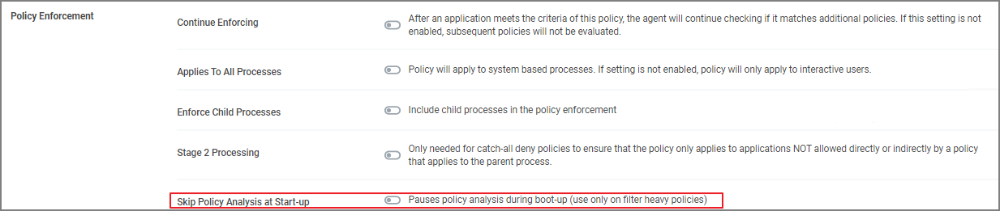

[title]: # (Increase Boot-up Performance)
[tags]: # (policy analysis)
[priority]: # (1)
# Increase Boot-up Performance

In environments with policies having many filters, starting policy analysis during boot-up can impact the overall boot performance.

If this is an issue in your environment you can pause the policy analysis during boot. Pause analysis during the boot-phase decreases CPU utilization and delays to the boot process.

## Enable Pausing Policy Analysis during Boot-up

Each policy by default has a list of policy enforcement options on the policy enforcement tab.

To enable pausing policy analysis during boot-up on filter-rich policies, select the checkbox next to __Pause Policy Analysis During Boot__.

>**Note**:
>The end of the boot-phase in which policy analysis is paused, is defined as the CPU utilization after start-up being below 25% for a minimum of 120 seconds. Once that benchmark is reached, policy analysis will start.
