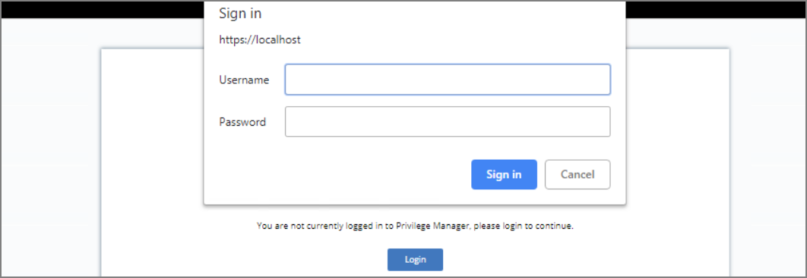
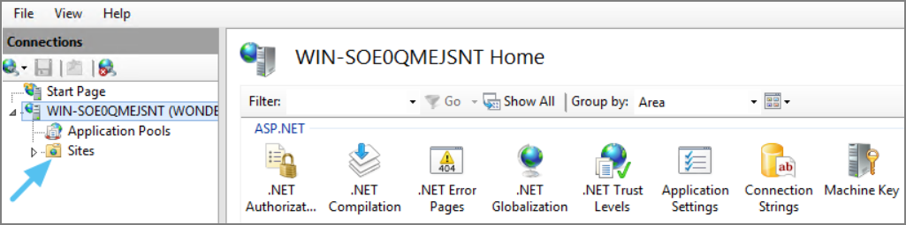
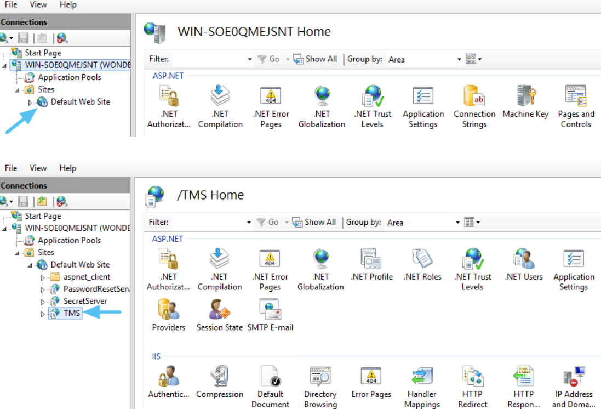
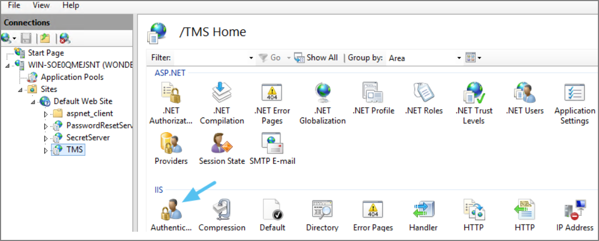
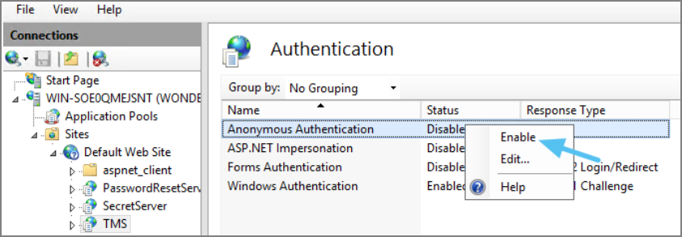
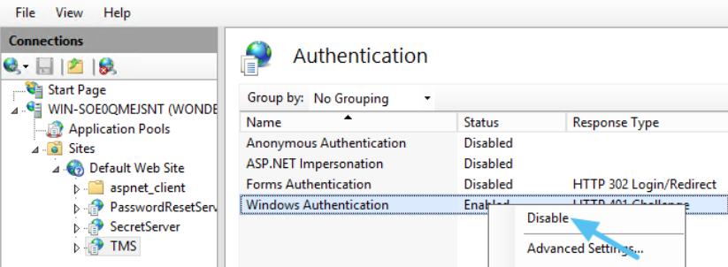
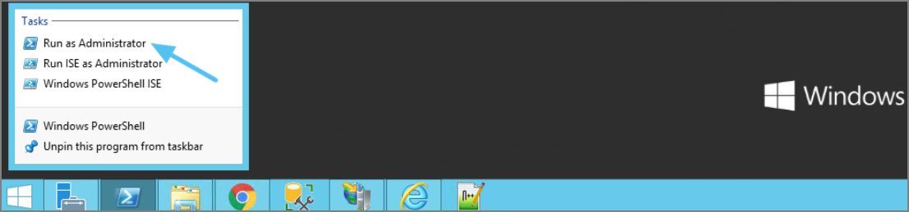

[title]: # (Unable to Access)
[tags]: # (sign in)
[priority]: # (2)
# Unable to Access Privilege Manager

When attempting to log in to Privilege Manager, you are unable to access the application window and see the following screen.

## Resolve

1. Open __Internet Information Services (IIS) Manager__.
1. Expand __Sites__.

   
1. Click the __TMS__ Site.

   
1. Click on __Authentication__.

   
1. Right-click on __Anonymous Authentication__.
1. Click __Enable__.

   
1. Right-click on __Windows Authentication__.
1. Click on __Disable__.

   
1. Open __Powershell__, type `iisreset` and press __Enter__.

   
1. Launch Privilege Manager.
