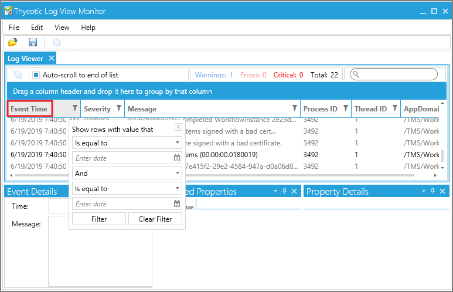

[title]: # (Using Thycotic Monitor)
[tags]: # (troubleshooting)
[priority]: # (10005)
# Using  Thycotic Monitor

While using Privilege Manager, you can utilize the Thycotic Monitor to help troubleshoot issues that occur on the web console.

1. On the server with the Privilege Manager installation navigate to `C:\ProgramFiles\Thycotic\ThycoticDiagnostics` and open the Thycotic Monitor.
1. Right-click on Thycotic Monitor and select Open.

   
1. Left-click on the filter icon for Event Time to filter for specific times in order to better help find a specific event.

   
1. Left-click on the filter icon for Severity to filter for specific severity levels.

   
1. Left-click on the filter icon for Message to narrow down specific messages and GUID's to help find errors.

   

>**Note**:
>If you’re attempting to troubleshoot an issue open the Thycotic Monitor and replicate the issue on the server that Privilege Manager is installed on. It may also be helpful to grab a screenshot including a time-stamp from when you replicate the error in order to better help with troubleshooting.

1. Open the Thycotic Monitor.
1. Replicate the issue server-side.
1. Select __File__.
1. Select __Save__.

The file saves as a .tracelog file type. You can upload the tracelog to your support case or review the event details for further information.
