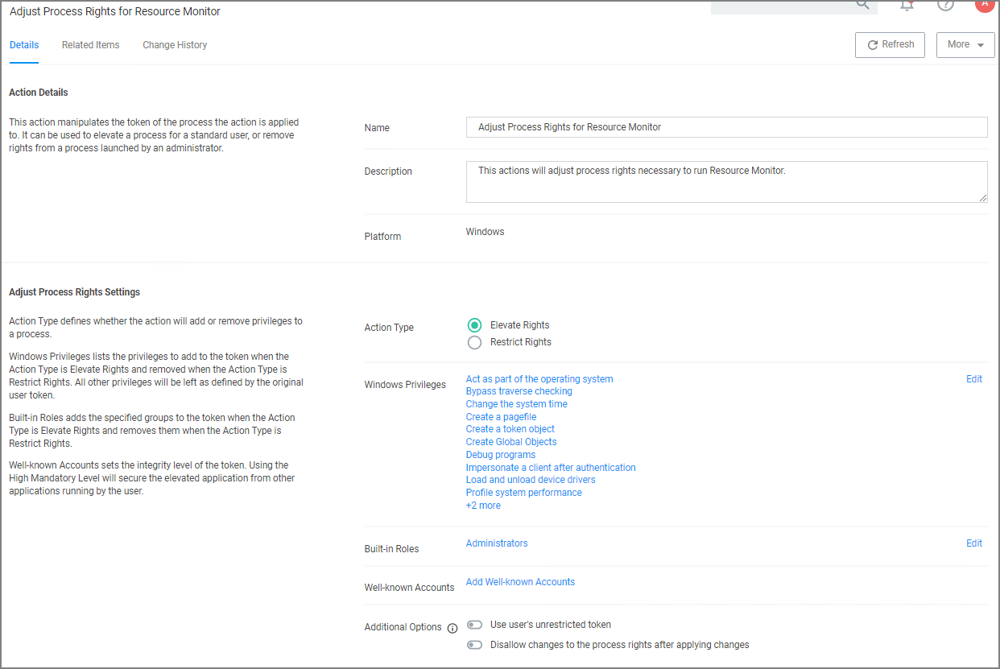

[title]: # (Using Process Explorer)
[tags]: # (troubleshooting)
[priority]: # (3)
# Using Process Explorer for Troubleshooting a Policy

This topic describes how to troubleshoot a policy with Process Explorer. Process Explorer is used to look at policies that grant administrative privileges, but don't seem to work when

* an application is accessed, or
* actions are supposed to run.

In the example below the policy allows resource monitor to run but the application is blank due to not having sufficient Windows Privileges. You can use Process Explorer to determine the correct Windows Privileges to add to the policy in order to use the resource monitor application.

## Detailed Troubleshooting Steps

1. Download [Process Explorer from the Mircosoft website](https://docs.microsoft.com/en-us/sysinternals/downloads/process-explorer) and extract the downloaded ProcessExplorer.zip file locally on your system.
1. Open __Process Explorer__.
1. Next open __Resource Monitor__ as the Administrator. 
1. Navigate back to the Process Explorer Window and find the Resource Monitor application (perfmon.exe).

   
1. Right-click and select __Properties__.
1. Select the __Security__ tab.
1. Under the Privilege section, you can see all the flags that are enabled in order to use the application.

   
1. Launch Privilege Manager and navigate to __Admin | Policies__.
1. Select the policy that elevates privileges to run Resource Monitor.
1. Select the __Actions tab__.
1. Select Add Administrative Rights or the elevation action you are using.

   
1. The new window will display what Windows Privileges the action is using.

   
1. Click Create a Copy.
1. Enter a Name, click Create.
1. Click Edit.
1. Select __Add for Windows Privileges__. (For this step you will have to determine which flags are enabled in Process Explorer in order to add the additional Windows Privileges to the action.)

   
1. In another window navigate to the following Microsoft web site @ https://docs.microsoft.com/en-us/windows/win32/secauthz/privilege-constants. The site will show the name of the Windows Privileges, along with the user right information that needs to be added to the action in Privilege Manager.

   For Example: The privileges listed under the properties security tab show __SeCreateGlobalPrivilege__ as enabled. On the Microsoft website for Privilege Constants @ https://docs.microsoft.com/en-us/windows/win32/secauthz/privilege-constants the user right for SeCreateGlobalPrivilege privilege is: __Create global Objects__.
1. Enter the User right into the search box and then select the user right from the returned list. In this example enter in Create global objects.

   
1. Click Save.
1. Navigate back to the Policy and open the Actions tab.
1. Click Edit.
1. Delete the original action by clicking on the recycle bin.
1. Click __+ Add Action__ and search for the new action (you may have to select the refresh icon next to the search box in case the new action doesn't appear).
1. Select the new action and click __Add__.
1. Click __Save__.
1. Navigate to the Deployment tab and trigger a policy update on the endpoints.

Once the agent has received the updated policy, the additional Windows Privileges will be applied to the application next time it is launched.
