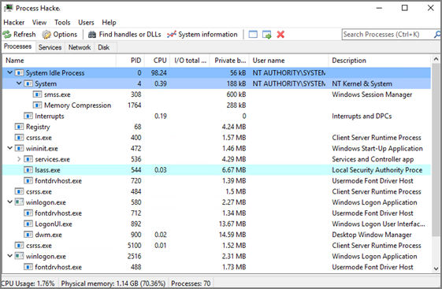
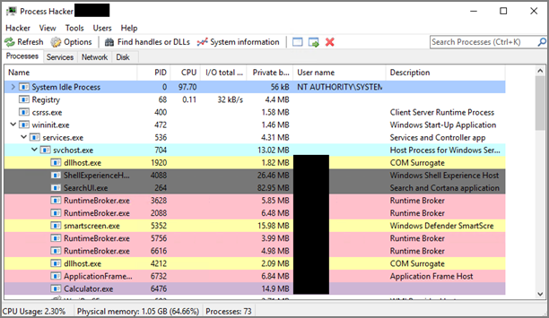
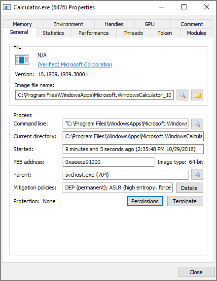

[title]: # (Using Process Hacker)
[tags]: # (troubleshooting)
[priority]: # (3)
# Using Process Hacker for Troubleshooting

Process Hacker is a third-party tool that can be useful for troubleshooting as well.  Please note that since this is a third-party tool, Thycotic is not responsible for any part of the application and has no control over it.

It can be used to determine whether a process you are trying to apply an action to is a parent process or a child process of another application.  If you do not want to install Process Hacker on the endpoint you are troubleshooting from, there is a portable version available as well that does not require it to be installed on the machine.

When you open Process Hacker, you will notice a screen like the one below that shows the running processes on the machine.

You will notice that some processes are listed underneath other processes.  The processes listed under other processes are child processes of the top parent one.  For example, after opening up the Calculator app on a test machine, the Process Hacker window looked like the screenshot below.

You can see at the bottom of the screenshot above that the Calculator.exe process is actually a child process of the svchost.exe process, which itself is a child process of the services.exe process, which is a child process of the wininit.exe process.  Not all processes will be nested underneath as many parent processes as in this example.

You can also double-click on the process to open a window with more information about the process.  You can find the parent process that way as well on the General tab of that window.  The screenshot below is what the General tab shows for the Calculator.exe process.

You can see the Parent field, which shows you that the svchost.exe process is the parent of the Calculator.exe process.  If you are viewing the parent process, then in the Parent field you will see “Non-existent process” instead of seeing a parent process listed.

You will also notice a Token tab in the screenshot above.  That tab is useful in showing you whether the process is running elevated; it shows an “Elevated” field, with values Yes or No. It will also show you the process security tokens that the application needs to run.  You normally do not need that information, but it is good to know where to find it, just in case.

As you can see from the information above, Process Hacker is a third-party tool that can be useful when troubleshooting why a policy is not applying like you think it should.  For example, if you are trying to elevate a specific application or process, it might not be working correctly if that process is actually a child process.  In that case, you can configure the policy to target the parent process and apply that same action to the child processes.  You might not need to target the parent process in all situations, but sometimes it will be necessary.
