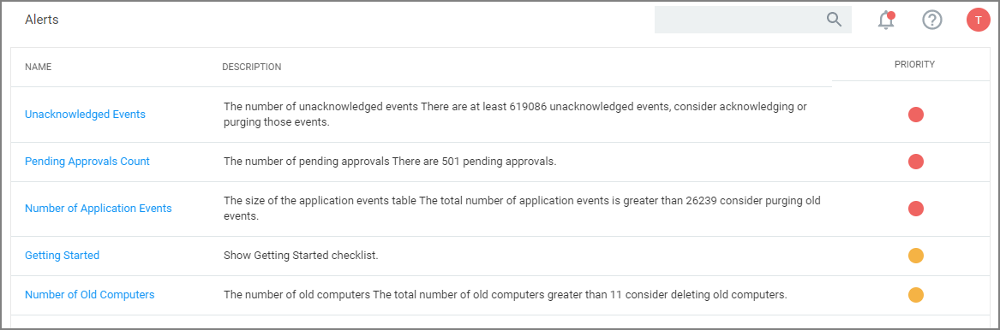
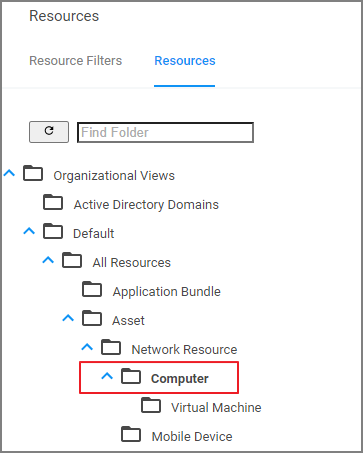
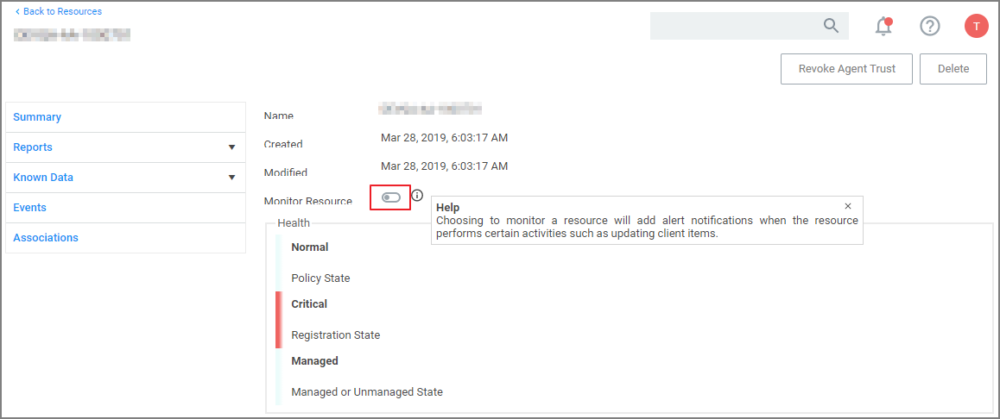
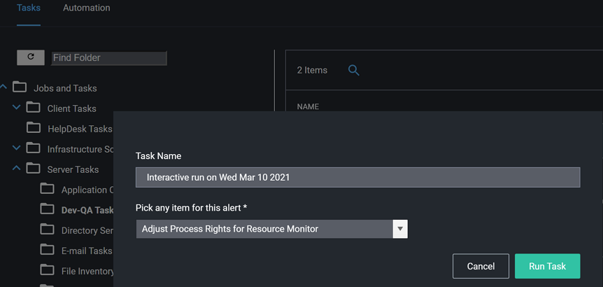
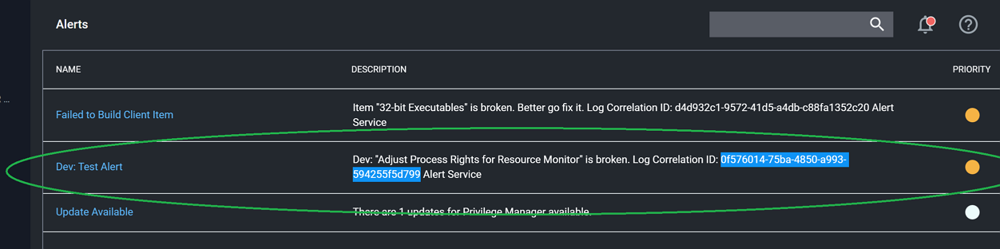
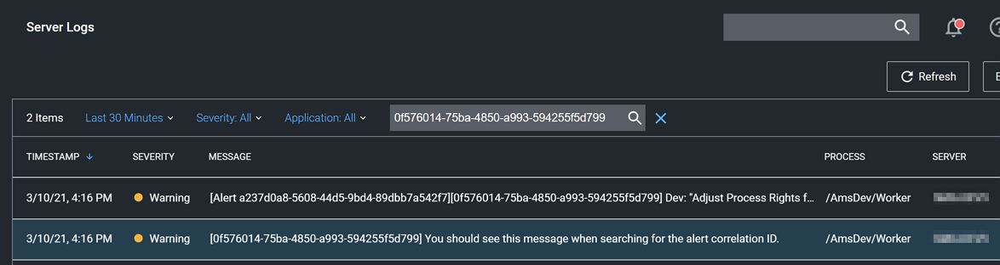

[title]: # (Alerts)
[tags]: # (active)
[priority]: # (2)
# Alerts

To access Alerts, click the icon and select Notifications from the menu options.

Alerts are listed by priority and category such as Unacknowledged Events, Pending Approvals Count, Number of Application Events, Install Agents, etc.

## Endpoint Specific Alerts

Alert Notifications can also be triggered for a specific endpoint agent, if the computer resource was configured for monitoring.

1. Navigate to __Admin | Resources__.
1. On the __Resources__ tab, open the __Computers__ folder.

   
1. From the list select the endpoint you with to monitor and open the Resource Explorer for that endpoint.
1. Set the __Monitor Resource__ switch to active.

   

Once monitoring is enabled, alert notifications for the agent end point are available. These type of alerts inform about the agent registration, resource discovery, and update retrieval times.

## Testing Alert Framework

<!-- HELP: Is this meant for customers? Are we moving the tasks from the dev config feed to the general config feed? Will the tasks be renamed if they are moved? -->

The Privilege Manager Alert framework notifies administrators about potential issues with their instance.

The framework introduces tasks under __Admin | Tasks, Jobs and Tasks | Server Tasks__:

* Raise Test Alert: This task, when run, raises an alert.
* Revoke Test Alert: This task, when run, clears an alert.

The alert contains a correlation ID, which can be used to look for further details in the logs:

