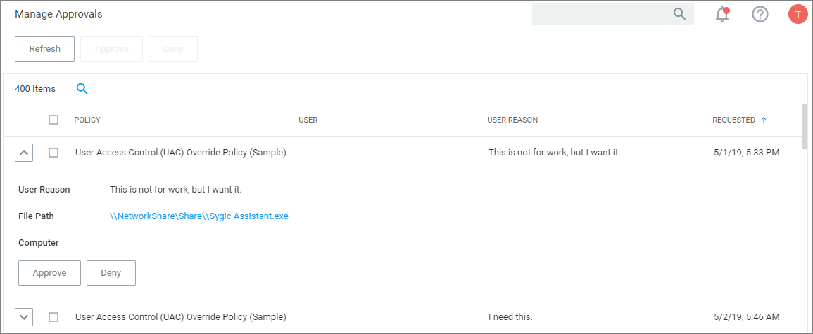

[title]: # (Manage Approvals)
[tags]: # (active)
[priority]: # (3)
# Manage Approvals

The Manage Approvals page can be accessed in two ways, via:

* the Alerts icon and selecting Manage Approvals or
* __Admin | Manage Approvals__ menu selection.

Use the expand/collapse icon (up/down chevron) to view and approve or deny requests.
