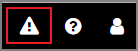
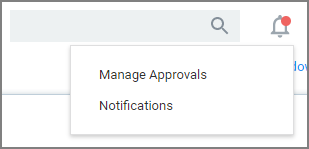

[title]: # (Notifications)
[tags]: # (active)
[priority]: # (1)
# Notifications

Notifications can be accessed via the icon next to the search bar in the top right corner of the Privilege Manager console. 

The notification icon displays an indicator when alerts are pending, such as:

* Manage Approvals
* Notifications

