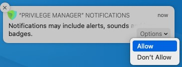

[title]: # (macOS Notifications)
[tags]: # (manage,alerts,notifications)
[priority]: # (2)

# Best Practices: Manage Privilege Manager Notifications on macOS

As of macOS Catalina, Apple provided the ability to [manage notification settings](https://developer.apple.com/documentation/devicemanagement/notifications/notificationsettingsitem) in macOS by using Configuration Profiles. The benefit of managing this setting is that you as the administrator have complete control over the desired state of that configuration on the endpoint. You want the user to be able to see the notifications that Privilege Manager sends out. If the setting is not managed the user may miss something important, if they previously clicked __Don’t Allow__.

This [example XML snippet](scripts/manage-notifications.xml) can be used and is based on the following property values. Depending on your chosen MDM provider, the example snippet might need editing.

* __AlertType__ : 1 (Temporary Banner)
* __BadgesEnabled :__ true (Enables the badge to be displayed for Privilege Manager)
* __BundleIdentifier__ : com.thycotic.privilegemanagergui
* __CriticalAlertEnabled__ : true (Enables critical alerts that can ignore the Do Not Disturb feature)
* __ShowInLockScreen :__ false (For privacy concerns it is recommended to not show in lock screen)
* __ShowInNotificationCenter__ : true (Enables notifications in the notification center for this app)
* __SoundsEnabled__ : true (enables sounds for this app)
