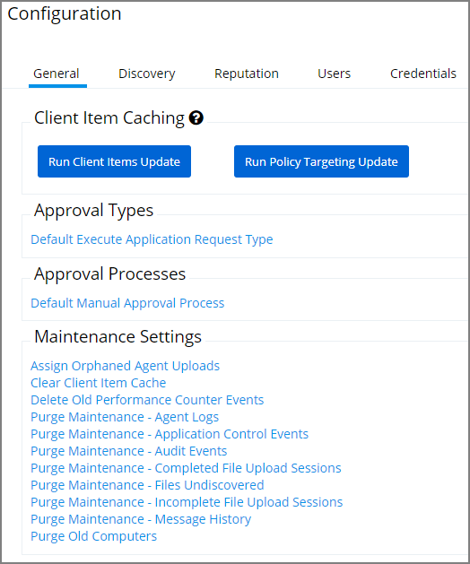

[title]: # (General Tab)
[tags]: # (admin,configuration)
[priority]: # (2100)
# General Tab

## Client Item Caching

The Client Items Update caches policies, filters, actions, and other agent items.

The Policy Targeting Update caches the list of policies applicable to each agent by updating the collections and resource targets.

## Approval Types

TODO

## Approval Processes

TODO

## Maintenance Settings

TODO
