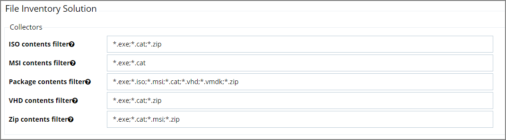

[title]: # (Collectors)
[tags]: # (general configuration)
[priority]: # (2)
# File Inventory Solution

Under the File Inventory Solution the file extensions used for inclusions and exclusions are specified. 

* ISO contents filters with default extensions of .exe, .cat, and .zip.
* MSI contents filters with default extensions of .exe, and .cat.
* Package contents filters with default extensions of .exe, .iso, .msi, .cat, .vhd, .vmdk, and .zip.
* VHD contents filters with default extensions of .exe, .cat, and .zip.
* ZIP contents filters with default extensions of .exe, .cat, . msi, and .zip.

When you click Edit at the bottom of the page, you can change any of the listed file extensions. 

