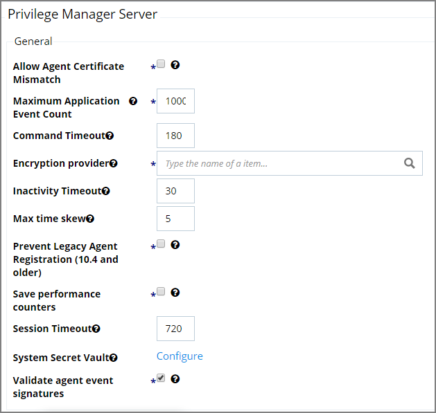
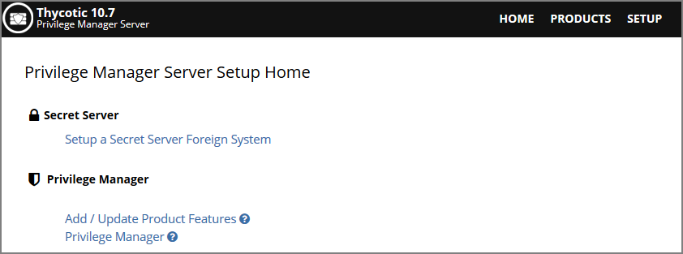

[title]: # (General System Settings)
[tags]: # (general configuration)
[priority]: # (3)
# General System Settings

Under the Privilege Manager Server category, the first section is General settings.

## Allow Agent Certificate Mismatch

This is a checkbox that when selected allows agents to communicate with the server even if there is a certificate mismatch.

## Maximum Application Event Count

This settings specifies the Maximum number of application action events that will be kept in the database. The default setting is 1,000,000.

## Command Timeout

This settings specifies the SQL command timeout. The default is 180 Seconds.

## Encryption Provider

This setting specified the Encryption Provider used to encrypt sensitive data.

## Inactivity Timeout

This settings specifies the maximum allowed time for inactivity when logged into the Privilege Manager console. The default is set to 30 Minutes. The session token remains active and does not need to be renegotiated when the inactivity timeout happens within the specified session timeout window.

## Max Time Skew

This setting specifies the maximum time difference (in minutes) to allow client system clocks to be out of sync with the server.

## Prevent Legacy Agent Registration (10.4 and older)

Enabling this setting prevents older agents (prior to 10.5) from registering, allowing only agents with valid agent Install Codes. Only enable this option if you are certain your managed computers have all been upgraded to 10.5 or newer agents.

## Save Performance Counters

If this setting is selected, the performance counter data will be recorded in the database.

## Session Timeout

This setting specifies the maximum time in __minutes__ for a login session to be active without having to negotiate another token. The default is set to 720 Minutes (12 Hours).

### Session Timeout Warning

Two minutes before the set session timeout window expires, Privilege Manager displays a yellow warning with countdown timer to inform users about the pending session timeout.

One minute before the timeout, the color changes to red.

Once the session times out, the active user is logged out and retured to the Privilege Manager Server Setup Home page.

## System Secret Vault

This link lets you configure the foreign system used to store secrets.

## Validate Agent Event Signatures

Enabling this setting will verify the signature contained within agent events that are sent to the server. Any events with invalid signatures are discarded.
