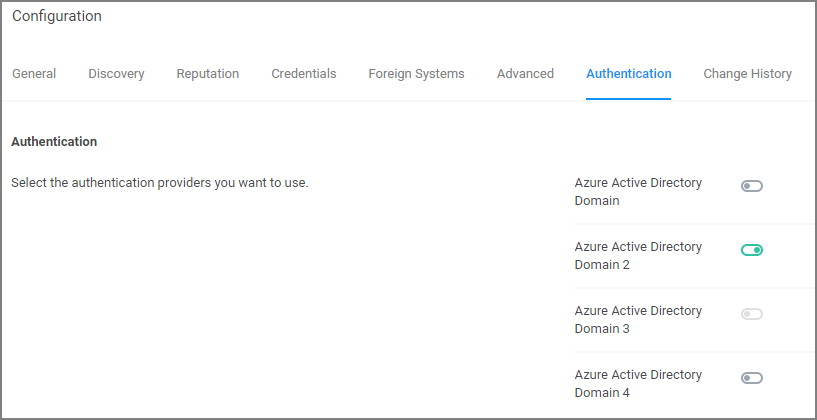

[title]: # (Authentication Tab)
[tags]: # (authentication provider)
[priority]: # (1)
# Authentication Tab

The Authentication tab is used for setting up the Authentication Provider used with Privilege Manager. There can only be one provider at a time.

>**Note**:
>If you are trying to change your Authentication Provider Privilege Manager runs a verification to make sure the new provider has users with Administrator Role privileges provisioned.
