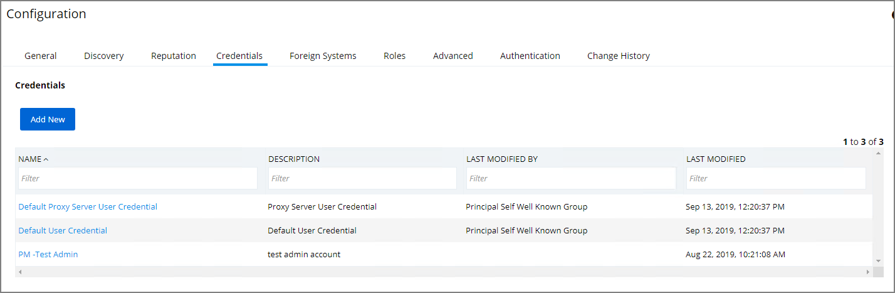

[title]: # (Credentials Tab)
[tags]: # (admin,configuration)
[priority]: # (1
# Credentials Tab

The Credentials tab lets you configure and add new credentials required for configured Foreign Systems.

