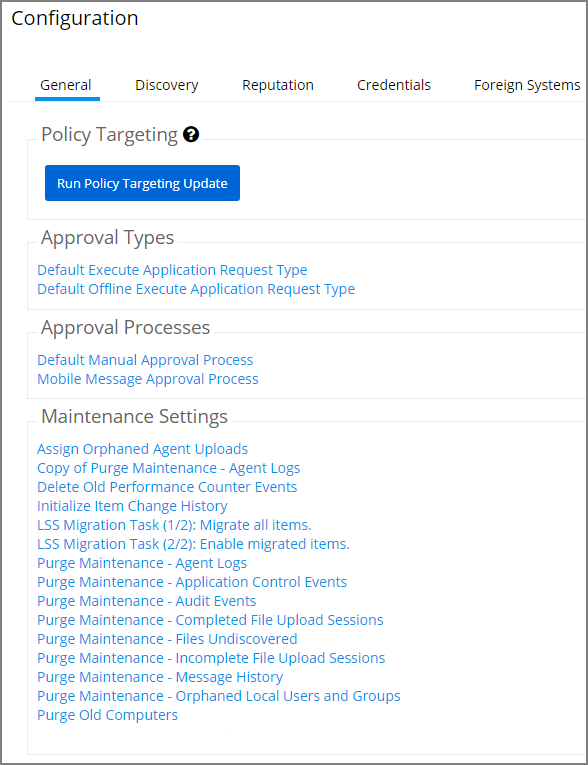

[title]: # (General Tab)
[tags]: # (admin,configuration)
[priority]: # (1)
# General Tab

The General Tab provides a quick access to Privilege Manager Maintenance tasks and job settings.

## Policy Targeting

The Policy Targeting Update automatically caches the list of policies applicable to each agent by updating the collections and resource targets.

## Approval Types

For approval types can be specified as policy or file specific, a Security Rating System can be added, and a Process Handler can be entered. The following default approval types are available:

* Default Execute Application Request Type
* Default Offline Execute Application Request Type

## Approval Processes

These are read-only items and by default Administrators are always allowed to approve any requests and an optionally activity can be started as part of the approval.

* Default Manual Approval Process
* Default Offline Approval Process
* Mobile Message Approval Process

## [Maintenance Settings](../../../tasks/maintenance.md)

* [Assign Orphaned Agent Uploads](../../../tasks/maintenance.md#assign_orphaned_agent_uploads)
* [Delete Old Performance Counter Events](../../../tasks/maintenance.md#delete_old_performance_counter_events)
* [Initialize Item Change History](../../../tasks/maintenance.md#initialize_item_change_history)
* [Purge Maintenance - Agent Logs](../../../tasks/maintenance.md#purge_maintenance___agent_logs)
* [Purge Maintenance - Application Events](../../../tasks/maintenance.md#purge_maintenance___application_control_events)
* [Purge Maintenance - Audit Events](../../../tasks/maintenance.md#purge_maintenance___audit_events)
* [Purge Maintenance - Completed File Upload Sessions](../../../tasks/maintenance.md#purge_maintenance___completed_file_upload_sessions)
* [Purge Maintenance - Files Undiscovered](../../../tasks/maintenance.md#purge_maintenance___files_undiscovered)
* [Purge Maintenance - Incomplete File Upload Sessions](../../../tasks/maintenance.md#purge_maintenance___incomplete_file_upload_sessions)
* [Purge Maintenance - Message History](../../../tasks/maintenance.md#purge_maintenance___message_history)
* [Purge Old Computers](../../../tasks/maintenance.md#purge_old_computers)
