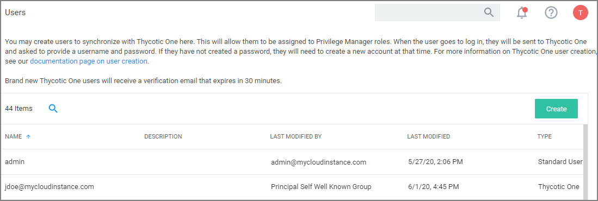
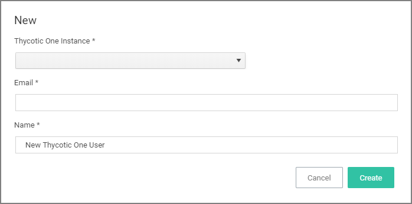
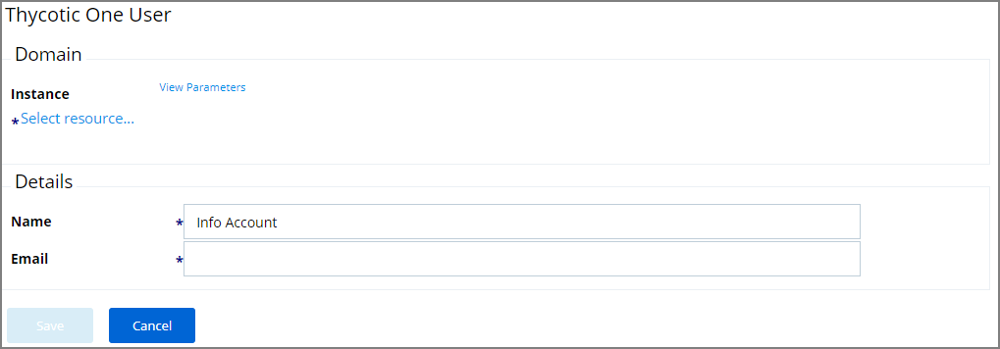
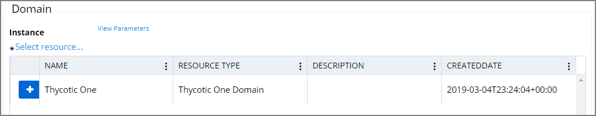
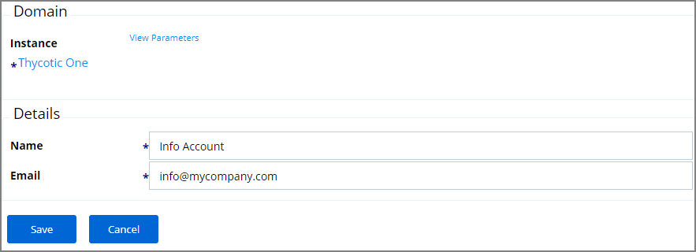

[title]: # (Users Tab)
[tags]: # (admin,configuration)
[priority]: # (1)
# Users Tab - Cloud Only

On the cloud only Users tab new users can be added to Privilege Manager. These users are specified as Thycotic One users.

## How to Add Thycotic One Users Manually

To manually add users to your Privilege Manager cloud instance, follow these steps:

1. Navigate to __Admin | Configuration__ and click the __Users__ tab.

   

2. Click __Add New__.

   

3. Enter the new username in the Name field and click Create.
4. Click the Edit button.

   

5. Click the Select resource link to select the Instance for this user.

   

6. Click the __+__ button to select the resource.
7. Under __Details__ in the Email field enter the accounts email address.

   

8. Click __Save__.
