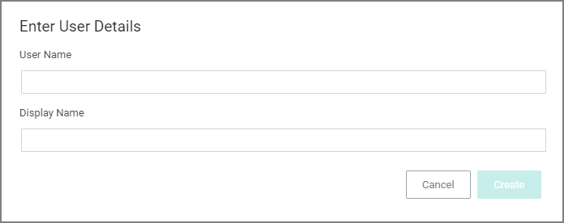

[title]: # (PM Users)
[tags]: # (admin,configuration)
[priority]: # (2)
# Privilege Manager Users

Administrator users can create and edit Privilege Manager users and assign and remove roles for these users.

There are three types of users:

* Thycotic One users - these are only available in cloud environments.
* API Users - these are available for the public API implementation.
* Standard Users - these are users added by an administrator after the initial installation of Privilege Manager.

Standard users can view and edit their own accounts, such as password updates, but can't create new users or delete their own user.

## Creating a New User

1. Navigate to __Admin | User__.

   
1. Click __New__.

   

   On-prem instances see a note that Thycotic One users can only be created if a Thycotic One Foreign System is configured.
1. On the __Select a User Type__ modal, from the drop-down select the type of user you want to add.

   
1. Click __Create__.

   
1. On the __Enter User Details__ modal, enter

   1. the __User Name__.
   1. the __Display Name__.
1. Click __Create__. The __User Details__ page opens.

   
1. On the newly created User's details page, add

   * the user's __email address__
   * an initial/temporary __password__. The user will be prompted to create a new password on initial login. While entering the initial password, the characters will be validated against rules and a red reminder is displayed as long as the entered password does not match those rules.
   * __roles__ to the user by clicking the __Add roles to a user here__ link. <!-- TODO: Is this working? I only get a list of roles here and now way of doing anything, besides looking at them and creating new roles.
   
   -->
1. Click __Save Changes__.

The user is now active in the system and you may edit the user details.

