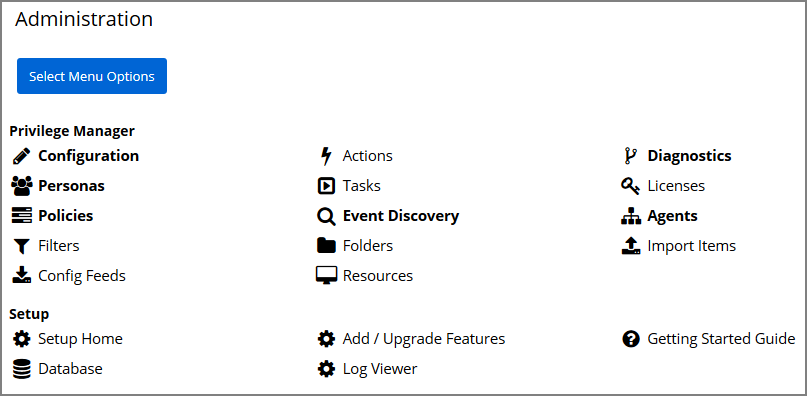
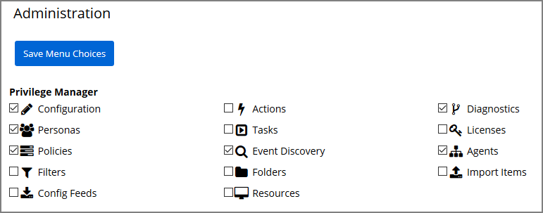
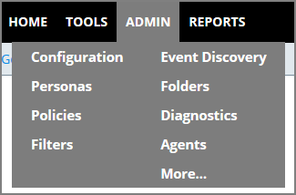

[title]: # (Menu Customization)
[tags]: # (user preferences)
[priority]: # (1)
# Menu Customization

The Privilege Manager console allows the customization of the quick access menu items. These are the product areas that are available when navigating to the Admin menu. The default options for quick access are Configuration, Personas, Policies, Event Discovery, Diagnostics, and Agents.

To change the default quick access menu options, follow these steps:

1. Navigate to __Admin | More__.

   

   Active quick access option are indicated as bold on this page.
1. Click __Select Menu Options__ to customize the quick access menu.

   
1. Select or deselect any of the checkboxes for the quick access menu items.
1. Click __Save Menu Choices__.

The menu options are immediately available for quick access under the Admin menu list. The following image shows the Admin menu after Filters and Folders have been selected.

