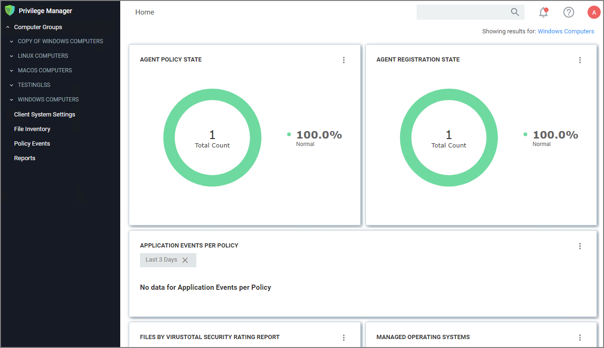

[title]: # (The Privilege Manager UI)
[tags]: # (console,home page)
[priority]: # (2000)
# The Privilege Manager UI

The Privilege Manager user interface, also referred to as the console, is launched in a browser. The URL has the following form:

https://[server-domain]/TMS/PrivilegeManager

Where:

* server-domain, indicates the customer specific domain name, for example

  * https://mydomain.com/TMS/PrivilegeManager for On-premises installations and
  * https://myassignedname.privilegemanagercloud.com/TMS for Cloud instances.

The User Interface (UI) seen by all Privilege Manager roles is the same (whether Administrator or other). However, most of the interface is enabled only when you login in as a Privilege Manager Administrator; the other roles are able to perform very few activities.

The screenshot below shows the the Privilege Manager home page, with the main page scrollable.

The home page includes actionable dashboard elements as well as the gateway to the two major components of Privilege Manager, Local Security and Application Control. These are available from their respective tiles.

Much of the text and other content on the page is clickable. The link under it will help you drill down to more detail. (Although some links, here and on other UI pages, are shown in blue, you should not assume that the absence of blue font implies there is no link. The best way to discover links is to hover over the content to find out if it is clickable.)

The set of three little vertical dots, in the upper right corner of each tile, provide options to manipulate the tile.

The __?__ seen near the right corner of the main menu bar, is used throughout the UI to provide help messages or other access to guidance.

## Gauges

Many aspects Privilege Manager can be customized. The gauges displayed on the home page of the Privilege Manager console and at many other pages can be remove and others can be added. The same with the Reports Options on the Reports page.

### What is a Gauge?

Gauges are used in Privilege Manager to display the results of periodic configuration checks of the server and endpoints. Gauges allow reports and graphs to keep historical trend data, and speed up access in the console.

### Reports and Gauges Currently Available

Privilege Manager currently has gauges published to track when an agent last communicated with the server, agents that have received all of their policies, agents that have a random password set, etc.

You can click gauges to drill down for more information.
