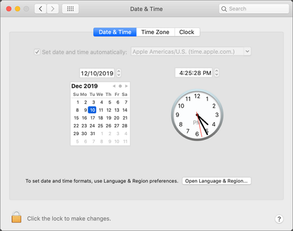
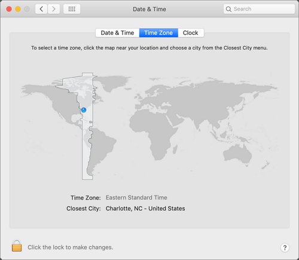
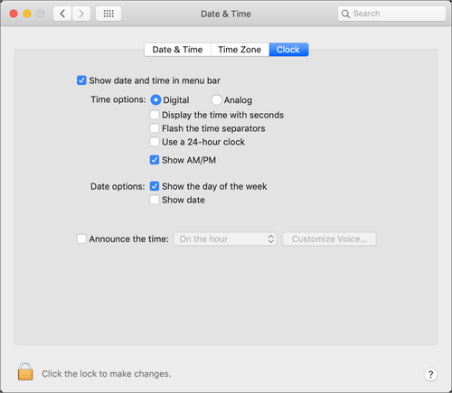
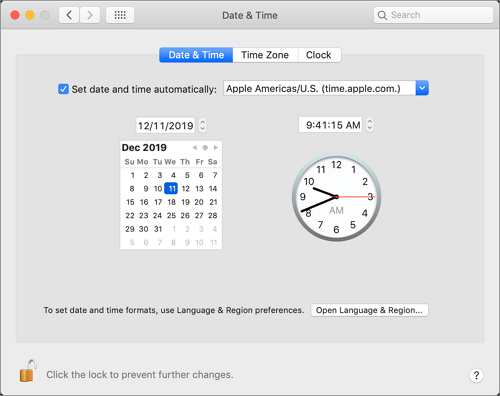
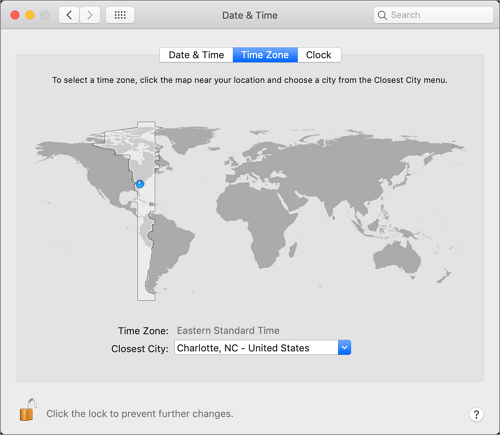
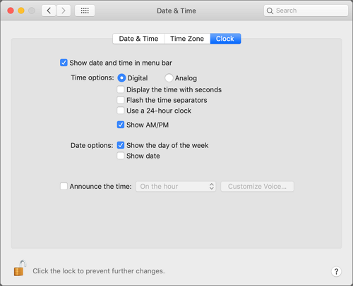

[title]: # (Date & Time)
[tags]: # (system preferences)
[priority]: # (3)
# Date & Time Preference Pane

## Standard User - System Defaults

For standard users when Date & Time is not managed by a policy, 

* all controls on the Date & Time tab are disabled and the padlock icon is closed.
* all controls on the Time Zone tab are disabled amd the padlock icon is closed.
* all controls on the Clock tab are enabled and changeable by the user. These are user specific settings.
* Clicking on the padlock icon results in a prompt, asking for administrator credentials.

| Date & Time Tab | Time Zone Tab | Clock Tab |
| ----- | ----- | ----- |
|  |  |  |

## Standard User - Managed by Policy

For standard users when Date & Time is managed by a policy to run as root,

* all controls on the Date & Time tab are enabled and changes are saved.
* all controls on the Time Zone tab are enabled and changes are saved.
* all controls on the Clock tab are enabled and changeable by the user. These are user specific settings.
* The padlock icon is unlocked.

| Date & Time Tab | Time Zone Tab | Clock Tab |
| ----- | ----- | ----- |
|  |  |  |

## Local Administrator User - Not Managed by a Policy

For local admin users, the padlock icon appears locked, by clicking on it a prompt is triggered to enter admin credentials. Once those admin credentials are entered, the padlock icon is unlocked and changes can be made.

Using a policy to run as root is not necessary for local admin users.