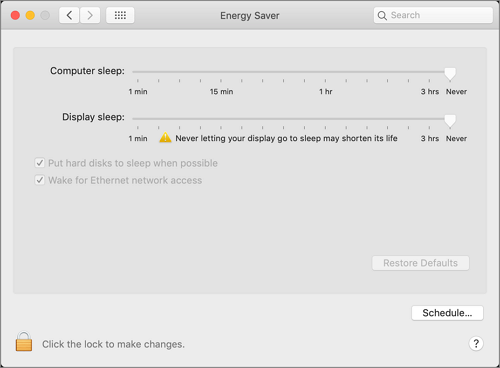
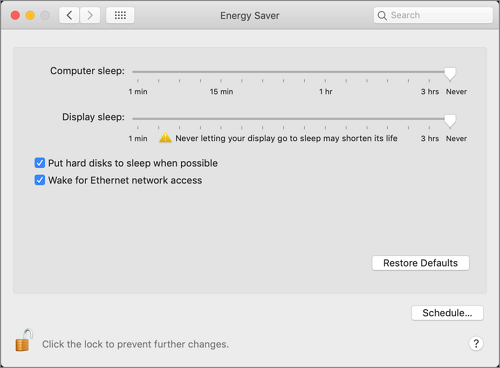
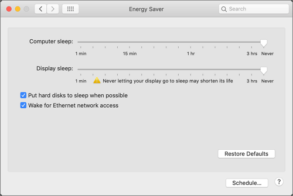

[title]: # (Energy Saver)
[tags]: # (system preferences)
[priority]: # (3)
# Energy Saver Preference Pane

## Standard User - System Defaults

For standard users when Energy Saver is not managed by a policy, 

* all controls are disabled and the padlock icon is closed.
* Clicking the Schedule… button shows a panel with disabled controls.
* Clicking on the padlock icon results in a prompt, asking for administrator credentials.

## Standard User - Managed by Policy

For standard users when Energy Saver is managed by a policy to run as root,

* all controls are enabled and changes are saved.
* Clicking the Schedule… button shows a panel with enabled controls. Any changes are saved.
* The padlock icon is unlocked.

## Local Administrator User - Not Managed by a Policy

For local admin users, the Energy Saver pane does not have a padlock and all controls are enabled and changeable. Any changes are saved.

Using a policy to run as root is not necessary for local admin users.
