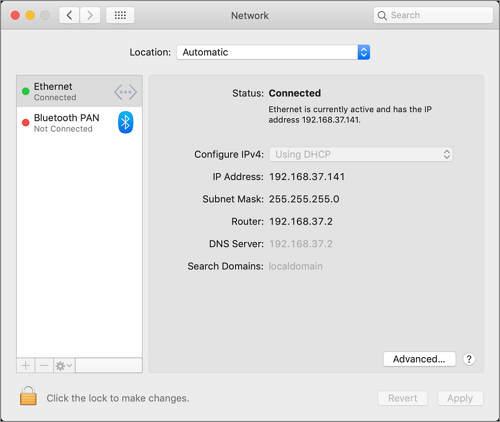
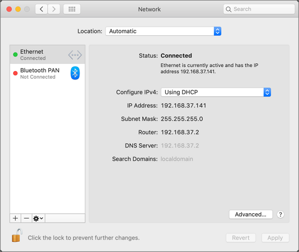
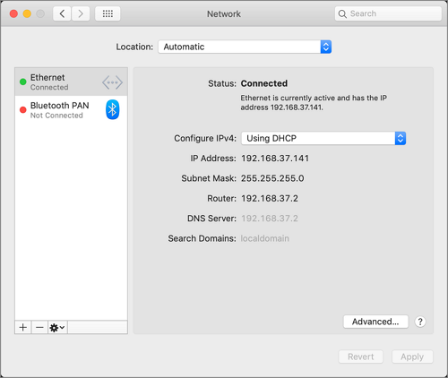

[title]: # (Network)
[tags]: # (system preferences)
[priority]: # (3)
# Network Preference Pane

## Standard User - System Defaults

For standard users when Network is not managed by a policy,

* all controls except for Location and Advanced are disabled and the padlock icon is closed.
* Clicking the Advanced… button opens a sheet depending on the network interface selected. Based on the selected interface, some elements may be enabled.
* Clicking on the padlock icon results in a prompt, asking for administrator credentials.

## Standard User - Managed by Policy

For standard users when Network is managed by a policy to run as root,

* all controls are enabled and changes are saved.
* Clicking the Advanced… button opens a sheet depending on the network interface selected. Based on the selected interface, elements are enabled.
* The padlock icon is unlocked.

## Local Administrator User - Not Managed by a Policy

For local admin users, the Network pane does not have a padlock and all controls are enabled and changeable. Any changes are saved.

Using a policy to run as root is not necessary for local admin users.
