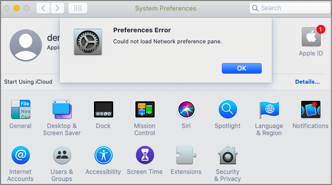

[title]: # (Preference Pane)
[tags]: # (system preferences)
[priority]: # (10)
# Preference Pane macOS

A Preference Pane (abbreviated as prefpane) is a dynamically loaded plugin in Mac OS X. Introduced in Mac OS X v10.0, the purpose of a Preference Pane is to allow the user to set preferences for a specific application or the system by means of a graphical user interface.

## Targeting Preference Panes

How do you target Preference Panes on macOS endpoints? On versions of Privilege Manager (10.3 and lower)<!-- is this true? Or should there be no version mentioned here?-->, you need to specify Preference Pane actions via filepath or file name. A chart is listed below for reference to some of the most common Preference Pane targets:

| Preference Pane  | File Name | File Path |
| ----- | ----- | ----- |
| App Store | com.apple.preferences.appstore.remoteservice | /System/Library/PreferencePanes/AppStore.prefPane/Contents/XPCServices/com.apple.preferences.appstore.remoteservice.xpc/Contents/MacOS/ |
| Date & Time | com.apple.preference.datetime.remoteservice | /System/Library/PreferencePanes/DateAndTime.prefPane/Contents/XPCServices/com.apple.preference.datetime.remoteservice.xpc/Contents/MacOS/ |
| Energy Saver | com.apple.preference.energysaver.remoteservice | /System/Library/PreferencePanes/EnergySaver.prefPane/Contents/XPCServices/com.apple.preference.energysaver.remoteservice.xpc/Contents/MacOS/ |
| Network | com.apple.preference.network.remoteservice | /System/Library/PreferencePanes/Network.prefPane/Contents/XPCServices/com.apple.preference.network.remoteservice.xpc/Contents/MacOS/ |
| Parental Controls | com.apple.preferences.parentalcontrols.remoteservice | /System/Library/PreferencePanes/ParentalControls.prefPane/Contents/XPCServices/com.apple.preferences.parentalcontrols.remoteservice.xpc/Contents/MacOS/ |
| Printers and Scanners | com.apple.preference.printfax.remoteservice | /System/Library/PreferencePanes/PrintAndScan.prefPane/Contents/XPCServices/com.apple.preference.printfax.remoteservice.xpc/Contents/MacOS/ |
| Security & Privacy | com.apple.preference.security.remoteservice | /System/Library/PreferencePanes/Security.prefPane/Contents/XPCServices/com.apple.preference.security.remoteservice.xpc/Contents/MacOS/ |
| Sharing | com.apple.preferences.sharing.remoteservice | /System/Library/PreferencePanes/SharingPref.prefPane/Contents/XPCServices/com.apple.preferences.sharing.remoteservice.xpc/Contents/MacOS/ |
| Time Machine | com.apple.prefs.backup.remoteservice | /System/Library/PreferencePanes/TimeMachine.prefPane/Contents/XPCServices/com.apple.prefs.backup.remoteservice.xpc/Contents/MacOS/ |
| User & Groups | com.apple.preferences.users.remoteservice | /System/Library/PreferencePanes/Accounts.prefPane/Contents/XPCServices/com.apple.preferences.users.remoteservice.xpc/Contents/MacOS/ |

## Catalina Preference Pane Behavior

Refer to [Best Practices System Preferences](bp-sys-pref.md) for details.
<!--
The File Specification Filter definition does not work on macOS 10.15 (Catalina) when the File Names field starts with __com.apple.preference__ and/or Path field starts with __/System/Library/PreferencePanes/__.
Any Policies leveraging these filter definitions are also impacted.

Your endpoint will display an error identifying the targeted preference pane:

-->
