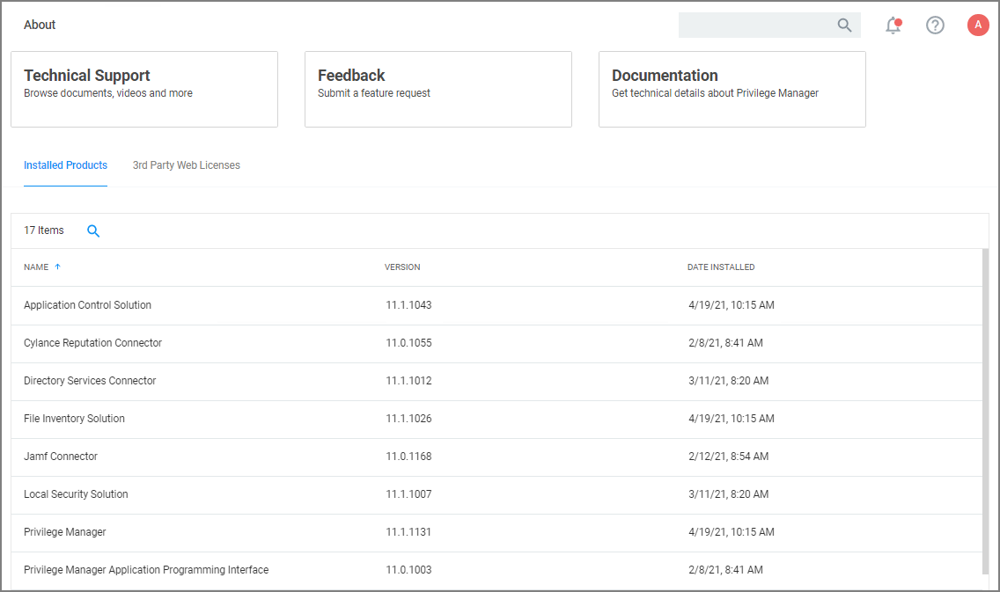
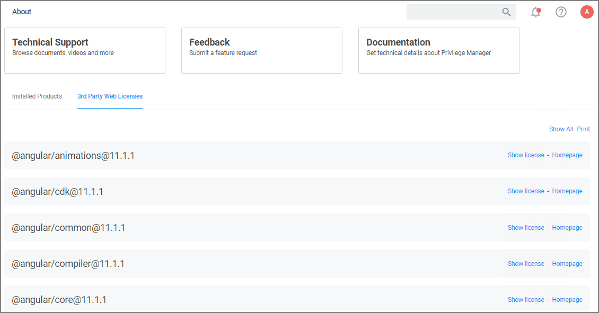
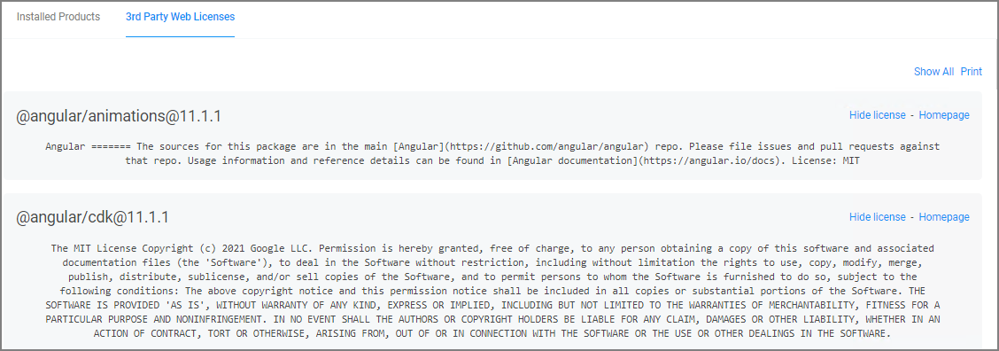

[title]: # (About Page)
[tags]: # (menus)
[priority]: # (2)

# The About Page

The About page provides navigation options to external sources such as the

* Support Portal
* Feedback
* Documentation

It further lists your currently installed Privilege Manager products:

Under the __3rd Party Web Licenses__ tab, you can review the 3rd party web licenses used by Privilege Manager:

Use __Show All__ to view details for all the licenses:

The Print option allows you to print a text file containing all 3rd party licenses and their details.
